# Secondary-Model

<p align="center">
  
  
  
  
  <a href="https://huggingface.co/datasets/Mollita/SecondaryModel"></a>
</p>

> Current `src/` workspace for the Secondary Model of the Meta-Labeling architecture, which operates on top of foundation models: **Kronos**, **Fincast**, **Chronos2**, **Tirex**.
> Driven by a **single unified** [src/config.yaml](src/config.yaml) and orchestrated by [src/Utils/experiments.py](src/Utils/experiments.py).

<table>
  <tr>
    <td bgcolor="#ccfbf1"><strong>Main Entry</strong><br /><code>Utils/experiments.py</code></td>
    <td bgcolor="#dbeafe"><strong>Model Registry</strong><br /><code>Utils/classifier/</code></td>
    <td bgcolor="#dbeafe"><strong>Config</strong><br /><code>config.yaml</code></td>
    <td bgcolor="#fef3c7"><strong>Outputs</strong><br /><code>src/Output/&lt;M1&gt;/</code></td>
    <td bgcolor="#ede9fe"><strong>Diagnostics</strong><br /><code>src/Output/Analysis/</code></td>
  </tr>
</table>

---

## Visual Overview

<p>
  
  
  
  
  
</p>

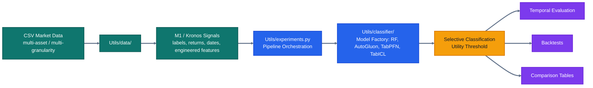

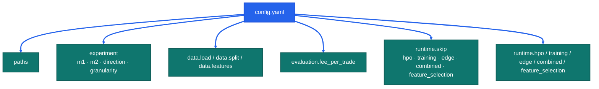

---

## Core Architecture

### 1. Train / Validation / Test Split

The pipeline follows the standard three-way chronological split, with temporal embargoes at each boundary to prevent label leakage.


| Window | Purpose |
| --- | --- |
| **Train** | Fitting the base classifier (Random Forest, AutoGluon, TabPFN, TabICL, or TabM). |
| **Validation** | Searching for the optimal financial risk-profitability utility threshold via grid search and hyperparameters tuning (using Optuna). |
| **Test** | Final, isolated out-of-sample backtest — never touched during training or tuning. |

### 2. Leakage Elimination & Embargo
We enforce **Temporal Embargoes** at every boundary. A purge window (based on the forecast horizon) is removed between `Train`, `Val`, and `Test` sets to prevent information leakage from overlapping labels in the financial time series.

---

### 3. Threshold Optimization

> **Source**: `Utils/selective_classification/thresholds.py::_find_best_utility_threshold`

Two modes are available via `runtime.training.thres`:

- **`utility`** — fits an Isotonic Regression calibrator on Val-Cal (Subset of Validation for Calibration), then optimizes τ on the **calibrated** Val-Opt probabilities (Subset of Validation for Optimization).
- **`utility_nocal`** — skips calibration, merges Val-Cal + Val-Opt into a single Validation window, and optimizes τ directly on the model's raw probabilities. **In our experiments this mode consistently produced better results** and is the recommended setting.

The threshold τ is chosen on the **Validation** split via a single-stage grid search. The winning τ and hyperparameters are then applied fixed to Test.

#### Stage A — Grid Search
Grid-searches τ ∈ [0.50, 0.95] over a hybrid grid (200 linspace points + all unique emitted probabilities ≥ 0.5). A candidate τ is accepted only when **all** of the following hold simultaneously:

| Gate | Condition |
|------|-----------|
| Coverage floor | Selected trades ≥ max(50, 5 % of Validation) |
| Positive return | Mean net-of-fee return μ > 0 |
| Precision gate | Precision(τ) ≥ max(precision(τ=0.5), M1 precision) |
| Statistical gate | Regularized t-stat t\* ≥ 1.0 (shrinkage prior n=50 toward base variance) |

Among all candidates the winner maximizes a **coverage-penalized utility score** (where `t*` is the regularized t-statistic from the Statistical gate above, computed as `μ / reg_std × √n` with shrinkage toward a prior variance estimated at τ=0.5):

```
utility = t* × cov_factor
cov_factor = 1.0              if cov ≥ cov_star (0.15)
           = (cov/cov_star)²  otherwise   # quadratic penalty for thin coverage
```

#### Fallback — τ = 0.50
If no threshold satisfies all Stage A constraints, the function returns τ = 0.50 with `constraint_satisfied = False`. The `threshold_source` field in every result JSON records which case fired (`"Utility-Opt"` or `"Baseline"`).

---

## Utils Architecture

The `Utils/` directory is a fully modular Python package tree. Each subdirectory is a standalone package with a curated public API in its `__init__.py`.

```
src/Utils/
├── __init__.py                        # top-level re-exports + sys.modules aliases for pickle compat
├── utils.py                           # shared small helpers (logging, path utils, etc.)
├── experiments.py                     # experiment orchestrator (training → edge → backtest)
│
├── classifier/                        # MODEL REGISTRY — single source of truth for all classifiers
│   ├── _classifier.py                 # BaseClassifier ABC (fit/predict/predict_proba/get_params/save/load)
│   ├── random_forest_classifier.py    # RFClassifier (sklearn Random Forest with OOB support)
│   ├── tabpfn_classifier.py           # TabPFN zero-shot wrapper
│   ├── tabpfn_finetuned_classifier.py # TabPFNFineTuned gradient-based fine-tuning wrapper
│   ├── tabicl_classifier.py           # TabICL in-context learning wrapper
│   ├── tabm_classifier.py             # TabM wrapper (parallel MLPs, optional PLE embeddings)
│   ├── ctts_classifier.py             # CTTS (CNN + Transformer) classifier
│   ├── ctts/                          # CTTS internal modules (cnn / transformer / mlp blocks)
│   ├── autogluon_classifier.py        # AutoGluon multi-stack wrapper
│   ├── factory.py                     # _build_tree_model(), MODEL_CHOICES, MODELS_NO_SCALING
│   └── __init__.py                    # re-exports all classifiers + factory symbols
│
├── analysis/                          # META-LABEL & M2 RESULT ANALYSIS
│   ├── analysis_meta_labels.py        # meta-label distributions, dataset-size plots, return quality
│   ├── analysis_m2.py                 # M2 result matrices, radars, selective-return distributions
│   └── __init__.py
│
├── calibration/                       # PROBABILITY CALIBRATION STUDIES
│   ├── analysis.py                    # isotonic / Platt calibration evaluation
│   ├── plots.py                       # reliability diagrams, calibration metrics
│   ├── __main__.py                    # entrypoint: python -m Utils.calibration
│   └── __init__.py
│
├── feature_selection/                 # FEATURE ANALYSIS
│   ├── feature_selection.py           # MDI/MDA/SFI importance, selection logic
│   ├── plots.py                       # feature ranking plots, confusion matrices, return histograms
│   └── __init__.py
│
├── selective_classification/          # SELECTIVE CLASSIFICATION
│   ├── calibration.py                 # probability post-processing utilities
│   ├── thresholds.py                  # utility-threshold search and application
│   └── __init__.py
│
├── backtest/                          # BACKTESTING & COMPARISON
│   ├── engine.py                      # equity construction, Sharpe, drawdown, run_combined_backtest
│   ├── plots.py                       # equity curves, performance dashboards
│   ├── comparison.py                  # separate-vs-unified, paradigm-level comparison tables
│   └── __init__.py
│
├── data/                              # DATA LOADING & PREPROCESSING
│   ├── data.py                        # MultiGranDataset, split_by_global_time, load_dataset_from_config
│   └── __init__.py
│
├── data_loaders/                      # FRAMEWORK-SPECIFIC DATA LOADERS
│   └── tabular_data_loader.py         # PyTorch DataLoader for tabular models (TabM / CTTS)
│
├── ts_cross_validation/               # TIME-SERIES CROSS-VALIDATION PRIMITIVES
│   ├── combinatorial_purged_cv.py     # CPCV (datetime-based default)
│   ├── purged_embargo_cv.py           # PurgedEmbargoTimeSeriesCV
│   ├── embargo_splits.py              # compute_embargo_splits helpers
│   └── __init__.py
│
├── edge/                              # EDGE CONVERGENCE (CPCV regime + seeds stability)
│   ├── edge.py                        # seeds stability + CPCV regime analysis, convergence scoring
│   ├── plots.py                       # edge report visualizations
│   ├── __main__.py                    # entrypoint: python -m Utils.edge
│   └── __init__.py
│
├── hpo/                               # HYPERPARAMETER OPTIMIZATION (Optuna)
│   ├── runner.py                      # trial execution, study management
│   ├── objectives.py                  # per-model objective functions
│   ├── search_spaces.py               # suggest_* functions (rf, tabpfn, tabicl, tabm, ctts)
│   ├── main.py                        # CLI argument parsing
│   ├── __main__.py                    # entrypoint: python -m Utils.hpo
│   └── __init__.py
│
└── feature_selection_experiment.py    # standalone SFS+/RFECV worker (Phase 4)
```

### Import conventions

All packages expose a clean public API through their `__init__.py`. Import from the package, not from internal submodules:

```python
# Correct
from Utils.classifier import TabPFN, _build_tree_model, MODEL_CHOICES
from Utils.backtest import run_combined_backtest, GRAN_ORDER
from Utils.data import load_dataset_from_config, split_by_global_time
from Utils.edge import run_cpcv_analysis, _gran_to_timedelta
from Utils.hpo import run_hpo

# Also correct (for internal helpers not re-exported at package level)
from Utils.classifier.factory import _AG_TIME_LIMIT, _AG_PRESETS
```

The `sys.modules` aliases in `Utils/__init__.py` (e.g. `Utils.data_preprocessing`, `Utils.models`) exist solely for pickle-cache backward compatibility — saved `.pt` cache files may embed old module paths that need to resolve at load time. Do not use these paths in new code.

---

## Model Registry: `Utils/classifier/`

All classifiers are `BaseClassifier` subclasses (sklearn-compatible: `fit` / `predict` / `predict_proba` / `get_params` / `save_model` / `load_model`). The `factory.py` module builds the correct classifier from a model name string.

### 1. Ensemble Tree Models
- **Random Forest (`rf`)**: Canonical baseline. Supports OOB predictions for out-of-bag probability estimation without a held-out validation set.

### 2. AutoGluon (`autogluon`)
Automated ML suite: multi-layer stacking and ensembling (Trees, KNN, Linear Models) within a time budget. Useful when no single architecture is known to dominate.
- **Reference**: [autogluon/autogluon](https://github.com/autogluon/autogluon)

### 3. TabPFN (Prior-Data Fitted Networks)
Foundation model for tabular data. Uses In-Context Learning (ICL) — a Transformer pre-trained on synthetic datasets performs zero-shot classification in a single forward pass.
- **Reference**: [PriorLabs/TabPFN](https://github.com/PriorLabs/TabPFN)
- **Zero-Shot (`tabpfn`)**: Pre-trained prior directly. Full HPO search space: `n_estimators`, `softmax_temperature`, `balance_probabilities`, `average_before_softmax`, `fit_mode`, `inference_config`.
- **Fine-Tuned (`tabpfn_ft`)**: Gradient-based fine-tuning to adapt to specific market distributions. Configurable `epochs`, `learning_rate`, `weight_decay`, `grad_clip_value`, `early_stopping`, `use_lr_scheduler`.

### 4. TabICL (Tabular In-Context Learning)
Transformer-based foundation model from INRIA/Soda. Same ICL principle as TabPFN, different architecture and training procedure.
- **Reference**: [soda-inria/tabicl](https://github.com/soda-inria/tabicl)
- **Zero-Shot (`tabicl`)**: Pre-trained checkpoint. Internally normalises features — do not pre-scale inputs.

### 5. TabM
MLP with weight-sharing across k parallel "mini-models" (Yandex Research). Trained from scratch on each dataset slice.
- **Reference**: [yandex-research/tabm](https://github.com/yandex-research/tabm)
- **(`tabm`)**: Configurable `k`, `n_blocks`, `d_block`, `lr`, `weight_decay`. Supports optional **Piecewise Linear Embeddings** (`use_plr=True`) which add `n_bins` and `d_embedding` to the search space.

All models share a 50 000-row soft sub-sampling guard (`_TABPFN_MAX_ROWS`) that warns and randomly sub-samples when exceeded.

---

## Setup

### 1. Conda environment

```bash
conda create -n S2 python=3.11
conda activate S2
pip install -r Secondary-Model/requirements.txt
```

### 2. Working directory

All commands below assume you are in `Secondary-Model/src/`:

```bash
cd Secondary-Model/src
conda activate S2
```

---

## Run Guide

### Direct run — `m2_pipeline.py`

The primary way to run a single training slice is to invoke `m2_pipeline.py` directly. You must always specify `--config`, `--phase`, `--m2`, `--direction`, and `--granularity`:

```bash
conda run -n S2 python m2_pipeline.py \
  --config config.yaml \
  --phase training \
  --m2 rf \
  --direction up \
  --granularity 4h
```

Each invocation trains, thresholds, and backtests exactly the `(m2, direction, granularity)` slice its CLI describes — nothing more.

### Sweep orchestration — `Utils/experiments.py`

For running the full cross-product of models, directions, and granularities defined in `config.yaml`, use `experiments.py`. It reads the `experiment.{m2, direction, granularity}` lists from the config and fans out one `m2_pipeline.py` subprocess per slice automatically:

```bash
conda run -n S2 python Utils/experiments.py --config config.yaml
```

`experiments.py` also orchestrates the downstream phases (edge, combined backtest, feature selection) in sequence. Configure which phases run via the `runtime.skip` flags in `config.yaml` — no CLI flags needed.

**CLI vs config contract.** The config defines *what a slice is made of* (data signature, splits, threshold/HPO knobs, output root). CLI args define *which slice a given invocation runs* (`--m2`, `--direction`, `--granularity`, `--phase`). Each subprocess honours its CLI selectors *exactly* — `--direction up --granularity 1d` trains only up/1d, nothing else.

#### Config knobs that drive the run

| Section | Key | What it does |
| --- | --- | --- |
| `experiment` | `m1` | M1 backbone — one of `kronos`, `fincast`, `chronos2`, `tirex`. **Must also update `paths.csv_dir` and `data.load.m1` to match.** |
| `experiment` | `m2` | List of M2 models to run (`rf`, `xgboost`, `autogluon`, `tabpfn`, `tabpfn_ft`, `tabicl`). |
| `experiment` | `direction` | List of directions (`up`, `down`, or both). |
| `experiment` | `granularity` | List of granularities from `GRAN_ORDER` (`1d`, `12h`, `8h`, `6h`, `4h`, `2h`, `1h`, `30m`). |
| `runtime.skip` | `hpo` / `training` / `edge` / `combined` / `feature_selection` | Flip to `false` to enable each phase. `true` skips it. |
| `runtime.hpo` | `n_trials`, `seed` | Phase 0 Optuna knobs — number of trials per `(m2 × direction × granularity)` and TPE sampler seed. Only `rf`, `tabpfn`, `tabicl` are HPO-supported; others skip HPO. |
| `runtime.training` | `thres`, `all_grans` | Training-phase knobs: threshold selection mode (`utility` or `utility_nocal`) and unified-vs-per-gran mode. |
| `runtime.edge` | `n_trials`, `n_blocks`, `k_test` | Edge convergence protocol — `n_trials` seeds (Random Forest/XGBoost only) + CPCV shape (`n_blocks`, `k_test`). |
| `runtime.combined` | `combined_backtest` | Populated automatically by `experiments.py`; leave as-is. |
| `runtime.feature_selection` | `cv_strategy`, `n_blocks`, `k_test`, `method`, `scoring`, `min_features`, `max_features`, `take_n_best_combinations` | SFS+/RFECV feature-selection knobs. |

#### Phases (driven by `runtime.skip`)

| Experiment Phases | What it runs | Enable via |
| --- | --- | --- |
| **0. HPO** | `python -m Utils.hpo` per `(m2 × direction × granularity)` — Optuna TPE search, writes `best_params.json` into `Output/<M1>/HPO/<m2>/<DIR>/<gran>/`. Models not in `HPO_SUPPORTED_M2 = {"rf", "tabpfn", "tabicl", "tabm", "ctts"}` are skipped automatically. | `runtime.skip.hpo: false` |
| **1. Train** | `m2_pipeline.py` per `(m2 × direction × granularity)` — train → threshold → backtest. Loads the matching `best_params.json` from Phase 0 via `_load_best_params`. For AutoGluon, also saves `ag_best_hyperparameters.json` inside `final_model/` for Phase 2 reuse. | `runtime.skip.training: false` |
| **2. Edge** | `python -m Utils.edge` — runs CPCV for all models; additionally runs `seeds` → `convergence` for Random Forest/XGBoost only. CPCV splits reuse HPO best_params (Random Forest/TabPFN/TabICL) and Phase 1 best hyperparameters (AutoGluon). | `runtime.skip.edge: true` **(disabled for the paper results — flip to `false` only to re-run the edge convergence study)** |
| **3. Backtest Combined** | `m2_pipeline.py` in `combined` phase — merges each model's UP+DOWN backtests. | `runtime.skip.combined: true` **(disabled for the paper results — flip to `false` only to regenerate the combined-direction backtests)** |
| **4. Feature selection** | `Utils/feature_selection_experiment.py` — SFS+/RFECV driven by `runtime.feature_selection`. | `runtime.skip.feature_selection: true` **(disabled for the paper results — flip to `false` only to re-run feature selection)** |

#### Hyperparameter reuse chain

Phases run sequentially (0 → 1 → 2 → 3 → 4). HPO results propagate downstream automatically:

- **Random Forest / TabPFN / TabICL**: `best_params.json` from Phase 0 is loaded by both Phase 1 (`m2_pipeline.py` via `_load_best_params`) and Phase 2 (`run_cpcv_analysis` via the same function). Each CPCV split uses `_build_edge_model(..., best_params=...)` → `_build_tree_model(params=...)` so the HPO-tuned hyperparameters are applied consistently.
- **AutoGluon**: No HPO phase (not in `HPO_SUPPORTED_M2`). Instead, Phase 1 training runs the full AutoML search (`time_limit=3600s, presets=best_quality`) and saves the winning model's type and hyperparameters to `ag_best_hyperparameters.json` via `AutoGluon.save_best_hyperparameters()`. Phase 2 CPCV loads this file via `_load_ag_best_hyperparameters()` and calls `model.fit_with_hyperparameters(X, y, ag_hyperparameters={...})` — training only the known-best model type with locked hyperparameters, no search overhead.
- **XGBoost / TabPFN_ft**: Use hard-coded defaults from `factory.py` (no HPO, no reuse).

#### Per-granularity resumability

`experiments.py` can be safely re-run after a crash or interruption — it detects already-completed work per `(m2, direction, granularity)` and skips it:

| Experiments Phases | Skip file checked | Path |
| --- | --- | --- |
| **0. HPO** | `best_params.json` | `Output/<M1>/HPO/<m2>/<DIR>/<gran>/best_params.json` |
| **1. Train** | `analysis_summary.json` | `Output/<M1>/<m2>/<DIR>/Utility_Score/<gran>_<mode>/analysis_summary.json` |
| **2. Edge** | `edge_trials.csv` / `cpcv_paths.csv` / `convergence_scores_<gran>.json` | `Output/Analysis/Edge/<M1>/<m2>/<DIR>/<gran>/{edge_trials.csv, cpcv_paths.csv}` and `Output/Analysis/Edge/<M1>/<m2>/<DIR>/convergence_scores_<gran>.json` |

To **force re-execution** of a specific granularity, delete its skip file and re-run `experiments.py`. Global `runtime.skip.<phase>: true` overrides all per-granularity checks — the entire phase is skipped.

#### Cache model — one multi-gran file per direction

Caches are **always multi-granularity**, one `.pt` per direction. Filename pattern: `multi_<m1>_<forecast_horizon>_fee_<direction>_<hash>.pt`, under `Output/<M1>/cache/`. The hash signs `data.load.*`, `data.window.*`, `data.features.*` and `m1` — any change invalidates the hash and a fresh cache is built on the next run.

- `_resolve_caches` (in [Utils/utils.py](src/Utils/utils.py)) auto-discovers both direction caches on every `m2_pipeline.py` invocation; missing directions are built from the config automatically. Both directions are always built on first run, so the next call for the opposite direction is a cache hit.
- `_filter_dataset_by_granularity` (also in `Utils/utils.py`) subsets the multi-gran cache to `--granularity` immediately after `torch.load` inside `run_analysis`. Every downstream step (split, HPO-resolved params, temporal eval, backtest) sees only that granularity's rows.
- `run_combined_backtest` and `run_unified_analysis` intentionally **do not** apply the per-gran filter — they are designed to operate across granularity folders / all granularities respectively.

To force a full rebuild: delete the existing `.pt` files under `Output/<M1>/cache/` and rerun any `m2_pipeline.py` command.

#### Final production-model persistence

Each completed training run persists a single production model — the one trained on Train and used for Test predictions. Saved per `(m2, direction, granularity)` at:

```
Output/<M1>/<m2>/<DIR>/<thres_mode>/<gran>_<mode>/final_model/
├── model{.pkl or native serialized files}   # native save_model with pickle fallback
├── ag_model/                                # AutoGluon-only: full predictor directory
├── ag_best_hyperparameters.json             # AutoGluon-only: best model type + params for CPCV reuse
└── bundle.pkl                               # scaler, col_indices, threshold,
                                             # features_used, model_name, best_params, meta
```

`<DIR>` is `UP` or `DOWN` (from `--direction`); `<gran>` is the CLI `--granularity`; `<mode>` is `data.load.meta_label_mode` (`tp`/`fp`/`og`).

CPCV fold models, seed-experiment replicas, and per-trial HPO models are **not** saved — only the final model returned by `temporal_eval(all features)`. The logic lives in [`Utils/classifier/factory.py:_save_final_model`](src/Utils/classifier/factory.py). For AutoGluon, `save_best_hyperparameters()` additionally writes a JSON file with such parameters.

#### Switching M1 backbone

Edit three fields together, then run `experiments.py`:

```yaml
paths:
  csv_dir: "Data_MLA/Fincast/Crypto/TP/horizon_7"   # <-- model name with uppercase first letter
experiment:
  m1: "fincast"       # <--- Change the name of the model (lowercase)
data:
  load:
    m1: "fincast"     # <--- Change the name of the model (lowercase)
```

`_load_config` validates that `data.load.m1` is consistent with `paths.csv_dir` and aborts with a clear error if they disagree.

> **AutoGluon note**: `time_limit` (default 3600s) and `presets` (default `best_quality`) are set in `Utils/classifier/factory.py` constants `_AG_TIME_LIMIT` and `_AG_PRESETS`. Edit those to change the defaults globally.

---

### `Utils/hpo/` — Hyperparameter Optimization

HPO is integrated as **Phase 0** of `experiments.py` (enabled with `runtime.skip.hpo: false`). Both Phase 1 (training) and Phase 2 read the resulting `best_params.json` automatically via `Utils.utils._load_best_params`, so HPO-tuned hyperparameters are consistently applied across the main training run and for Phase 2. You can also invoke HPO directly as a standalone CLI when you want to tune a specific `(model, direction, granularity)` combination without running the full pipeline — it reads the same `config.yaml` for paths, splits, and fees.

```bash
# ┏━━━━━━━━━━ HPO for Random Forest — up direction, 4h granularity, 50 trials ━━━━━━━━━━┓
conda run -n S2 python -m Utils.hpo \
  --config config.yaml \
  --models rf \
  --directions up \
  --grans 4h \
  --n-trials 50

# ┏━━━━━━━━━━ TabPFN + TabICL — both directions, multiple granularities ━━━━━━━━━━┓
conda run -n S2 python -m Utils.hpo \
  --config config.yaml \
  --models tabpfn tabicl \
  --directions up down \
  --grans 4h 1d 8h \
  --n-trials 100
```

Results are saved to `Output/<M1>/HPO/<model>/<direction>/<gran>/best_params.json`.

#### Search spaces

**Random Forest** (`rf`)

| Parameter | Type | Range / Choices |
|-----------|------|-----------------|
| `n_estimators` | int | 100 – 1000 (step 100) |
| `max_depth` | int | 3 – 12 |
| `min_samples_leaf` | int | 5 – 50 |
| `min_samples_split` | int | 5 – 50 |
| `max_features` | categorical | `sqrt`, `log2`, 0.5, 0.7, 0.9 |
| `class_weight` | categorical | `balanced`, `balanced_subsample` |

**TabPFN** (`tabpfn`)

| Parameter | Type | Range / Choices |
|-----------|------|-----------------|
| `n_estimators` | int | 4 – 32 (step 4) |
| `softmax_temperature` | categorical | 0.75, 0.8, 0.9, 0.95, 1.0, 1.05 |
| `balance_probabilities` | categorical | True, False |
| `average_before_softmax` | categorical | True, False |
| `preprocess_transform` | categorical | `quantile_uni_coarse`, `quantile_norm_coarse`, `kdi_alpha_0.3`, `kdi_alpha_3.0`, `none`, `safepower+quantile_uni`, `squashing_scaler_default` |
| `fingerprint_feature` | categorical | True, False |
| `outlier_removal_std` | categorical | None, 7.0, 12.0 |
| `min_unique_for_numerical` | categorical | 1, 5, 10, 30 |

**TabICL** (`tabicl`)

| Parameter | Type | Range / Choices |
|-----------|------|-----------------|
| `n_estimators` | int | 4 – 32 (step 4) |
| `softmax_temperature` | float | 0.3 – 1.5 (step 0.1) |

**TabM** (`tabm`)

| Parameter | Type | Range / Choices |
|-----------|------|-----------------|
| `d_block` | int | 64 – 1024 (step 16) |
| `lr` | float (log) | 1e-4 – 5e-3 |
| `weight_decay` | float (log) | 0 or 1e-4 – 1e-1 |
| `use_plr` | categorical | True, False |
| `n_blocks` | int | 1 – 5 (1 – 4 with PLE) |
| `n_bins` *(PLE only)* | int | 2 – 128 |
| `d_embedding` *(PLE only)* | int | 8 – 32 (step 4) |

---

## Current Project Map

| Path | Role |
| --- | --- |
| `config.yaml` | **Single source of truth** — paths, dates, features, M1 backbone, M2 model list, phase toggles, edge/feature-selection parameters. |
| `Utils/experiments.py` | **User entry point.** Reads `config.yaml`, orchestrates training → edge → combined → feature-selection phases across every `(m2 × direction × granularity)` combination. |
| `m2_pipeline.py` | Worker for training and combined phases; invoked as a subprocess by `experiments.py` with `--config <yaml> --m2 <x> --direction <up\|down> --granularity <gran>`. Supports direct invocation with the same CLI for targeted runs. |
| `Utils/feature_selection_experiment.py` | Worker for the feature-selection phase; invoked as a subprocess by `experiments.py`. |
| `Utils/classifier/` | Central model registry: `BaseClassifier` ABC, all classifier wrappers, `_build_tree_model` factory, `MODEL_CHOICES`, `MODELS_NO_SCALING`. |
| `Utils/edge/` | Worker for the edge phase — CPCV regime sensitivity (all models) + optional seeds stability (Random Forest/XGBoost only). CPCV splits reuse HPO best_params and AutoGluon best hyperparameters from Phase 1. Invoked as `python -m Utils.edge` by `experiments.py`. |
| `Utils/data/` | Dataset loading, multi-asset assembly, multi-granularity wrapping, chronological splitting, embargo/purge logic. |
| `Utils/data_loaders/` | Framework-specific data loaders (PyTorch `DataLoader` for tabular models such as TabM and CTTS). |
| `Utils/ts_cross_validation/` | CPCV, PurgedEmbargoTimeSeriesCV, and embargo-split helpers consumed by `Utils/edge/` and `Utils/feature_selection_experiment.py`. |
| `Utils/feature_selection/` | Feature diagnostic plots (correlation heatmap, pointbiserial, MI, confusion matrix, risk-coverage curve). |
| `Utils/analysis/` | Meta-label and M2 result analysis plots (dataset-size, return-quality, selective-return, results matrices, radars). |
| `Utils/calibration/` | Probability-calibration study CLI (`python -m Utils.calibration`) — reliability diagrams, isotonic vs Platt comparisons. |
| `Utils/backtest/` | Backtest helpers, equity construction, Sharpe/drawdown, reporting, combined UP+DOWN backtest, comparison tables. |
| `Utils/hpo/` | Optuna-based HPO — Phase 0 of `experiments.py`. Results consumed by both Phase 1 training and Phase 2 CPCV. CLI: `python -m Utils.hpo`. |
| `Utils/selective_classification/` | Utility-threshold selection (`utility` / `utility_nocal` modes). |
| `Data_MLA/` | Per-M1 dataset assets and technical indicator computation (one subfolder per backbone: `Kronos/`, `Fincast/`, `Chronos2/`, `Tirex/`). Download from 🤗 [Mollita/SecondaryModel](https://huggingface.co/datasets/Mollita/SecondaryModel). |

---

## Configuration Reference

The project has exactly **one** config file: [src/config.yaml](src/config.yaml). Its schema:

```yaml
# ┏━━━━━━━━━━ Paths ━━━━━━━━━━┓
paths:
  csv_dir:     "Data_MLA/Kronos/Crypto/TP/horizon_7"
  output_root: "Output"

# ┏━━━━━━━━━━ Experiment matrix — the cross product that experiments.py sweeps ━━━━━━━━━━┓
experiment:
  m1:          "kronos"                            # kronos | fincast | chronos2 | tirex
  m2:          ["rf"]                              # rf | xgboost | autogluon | tabpfn | tabpfn_ft | tabicl
  direction:   ["up", "down"]
  granularity: ["1d", "12h", "8h", "6h", "4h", "2h", "1h", "30m"]

# ┏━━━━━━━━━━ Data ━━━━━━━━━━┓
data:
  load:
    symbol:           null           # null → all assets (required for meaningful training)
    m1:               "kronos"       # MUST match experiment.m1 and paths.csv_dir
    target_col:       "meta_label"
    meta_label_mode:  "tp"           # fp | tp | og
    direction:        "up"
    granularity:      "all"          # "all" = multi-granularity cache
    forecast_horizon: 7
  split:
    start_date: "2024-07-01"
    train_end:  "2025-05-30"
    val_end:    "2025-10-01"
    end_date:   "2026-01-25"
  features:
    input: ["open", "high", "low", "close", "volume"]
    engineered_features:
      selected: [bb_pctb_last, rsi_last, roc_5_last, roc_20_last, atr_norm_last]
    feature_selection:
      enabled: false
      methods: ["mda", "shap", "lime"]
      top_k:   null

# ┏━━━━━━━━━━ Evaluation ━━━━━━━━━━┓
evaluation:
  fee_per_trade: 0.002

# ┏━━━━━━━━━━ Runtime — phase toggles and per-phase knobs ━━━━━━━━━━┓
runtime:
  skip:
    hpo:               false
    training:          true
    edge:              true
    combined:          true
    feature_selection: false

  hpo:
    n_trials: 100       # Optuna trials per (m2, direction, granularity)
    seed:     42        # TPE sampler seed

  training:
    paradigm_comparison: null
    combined_backtest:   null
    comparison:          null
    all_grans:           false
    thres:               "utility"   # utility | utility_nocal

  edge:
    n_trials: 100
    n_blocks: 6
    k_test:   2

  combined:
    combined_backtest: ["place_holder_up", "place_holder_down"]   # populated by experiments.py

  feature_selection:
    cv_strategy:              "cpcv"    # cpcv | tscv | pecv
    n_blocks:                 10
    k_test:                   2
    method:                   "sfs+"
    scoring:                  "accuracy"
    min_features:             1
    max_features:             33
    take_n_best_combinations: 10
```

### Parameter meanings

#### `paths`
| Key | Meaning |
| --- | --- |
| `paths.csv_dir` | Root directory of the M1 backbone's processed CSVs. Must match `experiment.m1`. |
| `paths.output_root` | Base output directory. Artifacts land under `Output/<M1>/`. |

#### `experiment`
| Key | Meaning |
| --- | --- |
| `experiment.m1` | M1 backbone. Determines the output bucket (`Output/Kronos/`, `Output/Fincast/`, etc.). |
| `experiment.m2` | List of M2 models to sweep. |
| `experiment.direction` | Directions to sweep (`up`, `down`, or both). |
| `experiment.granularity` | Granularities to sweep. |

#### `data.load`
| Key | Meaning |
| --- | --- |
| `data.load.symbol` | Always `null` — the pipeline requires all assets for sufficient training samples. |
| `data.load.m1` | Must match `experiment.m1` and `paths.csv_dir`. Validated at load time. |
| `data.load.target_col` | Target column the M2 classifier predicts. |
| `data.load.meta_label_mode` | Meta-label variant (`tp` is the active setup). |
| `data.load.direction` | Vestigial — `m2_pipeline.py` requires `--direction` on the CLI (no default fallback to this field). Cache selection is driven by `--direction`; `_resolve_caches` auto-builds both `up` and `down` caches on first run. |
| `data.load.granularity` | `"all"` enables multi-granularity cache assembly. |
| `data.load.forecast_horizon` | Prediction horizon; drives return alignment and backtests. |

#### `data.split`
| Key | Meaning |
| --- | --- |
| `start_date` / `train_end` / `val_end` / `end_date` | Chronological boundaries for Train / Validation / Test with embargo gaps. |

#### `data.features`
| Key | Meaning |
| --- | --- |
| `features.input` | Raw OHLCV columns fed into indicator computation. |
| `features.engineered_features.selected` | Engineered window-level features exposed to the M2 model. |
| `features.feature_selection.enabled` / `methods` / `top_k` | MDA/SHAP/LIME ranking and optional pruning. |

#### `evaluation`
| Key | Meaning |
| --- | --- |
| `evaluation.fee_per_trade` | Transaction fee used by utility-threshold selection and backtests. |

#### `runtime.skip`
Flip each flag to `false` to enable its phase. `experiments.py` iterates phases 1→4 in order, skipping any that are `true`.

#### `runtime.training`
Threshold mode (`utility` or `utility_nocal`) and the `all_grans` toggle for unified-vs-per-gran mode.

#### `runtime.edge`
Seeds trial count (`n_trials`, Random Forest/XGBoost only — ignored for AutoGluon/TabPFN/TabICL), CPCV block count (`n_blocks`), and CPCV test-block count per split (`k_test`).

#### `runtime.combined`
`combined_backtest` is **auto-populated** by `experiments.py` from the training phase outputs — don't edit the placeholder pair by hand.

#### `runtime.feature_selection`
CV strategy (`cpcv`, `tscv`, `pecv`), SFS+/RFECV shape (`method`, `n_blocks`, `k_test`, `min_features`, `max_features`, `take_n_best_combinations`), and scoring metric (`accuracy`, `precision`, `roc_auc`).

---

## Outputs

```text
src/Output/
└── Kronos/
    ├── autogluon/
    │   ├── DOWN/  {Utility_Score/}
    │   └── UP/    {Utility_Score/}
    ├── cache/
    ├── HPO/   # Phase 0 outputs — best_params.json per (m2, dir, gran)
    │   └── <m2>/<DIR>/<gran>/best_params.json
    └── rf/
        ├── DOWN/
        │   ├── Utility_Score/<gran>_<mode>/final_model/            # thres = "utility"
        │   └── Utility_Score_NoCal/<gran>_<mode>/final_model/      # thres = "utility_nocal"
        └── UP/
            ├── Utility_Score/<gran>_<mode>/final_model/            # thres = "utility"
            └── Utility_Score_NoCal/<gran>_<mode>/final_model/      # thres = "utility_nocal"
```

- `src/Output/<M1>/` is the active result tree for the currently configured M1 backbone.
- `src/Output/<M1>/cache/` stores `MultiGranDataset` pickles, rebuilt on demand from `config.yaml`.
- `src/Output/<M1>/HPO/` stores Phase 0 best-params JSONs, consumed by Phase 1 via `_load_best_params`.
- `final_model/` inside each run folder holds the single production classifier used for Test predictions (see "Final production-model persistence" above).
- Additional model folders (`tabpfn/`, `tabicl/`, `xgboost/`) appear when those runs are generated. Legacy `randforest/` dirs from pre-rename runs are left in place.
- `src/Output/Analysis/` contains edge and theory study outputs (cross-model, cross-M1).

---

## Practical Notes

- The canonical output location for run results is `src/Output/<M1>/` (M1 taken from `experiment.m1`).
- **You can run the pipeline either through `Utils/experiments.py` (full sweep) or by invoking the workers directly.** `experiments.py` orchestrates the `(m2 × direction × granularity)` sweep. The workers — `m2_pipeline.py`, `python -m Utils.edge`, `Utils/feature_selection_experiment.py` — accept `--config` as a YAML file path plus CLI selectors (`--m2 / --direction / --granularity`) and can be launched on their own for targeted runs or debugging. Each direct invocation runs *exactly* the slice its CLI describes — `--direction up --granularity 1d` does up/1d only.
- `Utils/feature_selection/` and `Utils/backtest/comparison.py` are library modules; they are reached via the training / feature-selection phases in `experiments.py`, not standalone CLI.
- Do **not** pre-scale inputs for TabPFN or TabICL — both models normalize features internally. The scaler bypass is controlled by `MODELS_NO_SCALING` in `Utils/classifier/factory.py`.
- The M2 model list in `experiment.m2` is resolved to concrete classifiers in `Utils/classifier/factory.py` via `_build_tree_model()`.
- `Utils/hpo` is integrated as Phase 0 of `experiments.py` (toggle via `runtime.skip.hpo`); it also supports a standalone CLI with `--config config.yaml`.
- `HPO_SUPPORTED_M2 = {"rf", "tabpfn", "tabicl", "tabm", "ctts"}` (defined in `Utils/utils.py`). Other M2 models (AutoGluon, XGBoost, TabPFN_ft) skip Phase 0 and use the defaults in `Utils/classifier/factory.py::_build_tree_model`.

---

## Results

### Dataset & Return Quality Overview

**Meta-label dataset size across M1 models and granularities.** Each bar shows the number of labeled samples available to train the M2 classifier for a given (M1, granularity) pair. Slight imbalance across granularities is expected — shorter bars at finer granularities reflect stricter label quality filters.

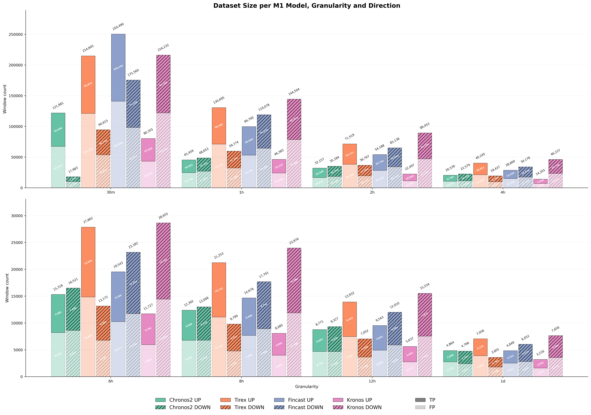

**Return quality boxplot — True Positives vs False Positives, aggregated across M1 models.** Each box pair shows the distribution of trade returns for correctly predicted (TP) and incorrectly predicted (FP) signals for the given M1 model across all granularities (1d, 12h, 8h, 6h, 4h, 2h, 1h, 30m). A clear positive separation between TP and FP return distributions is the prerequisite for meta-labeling to add value.

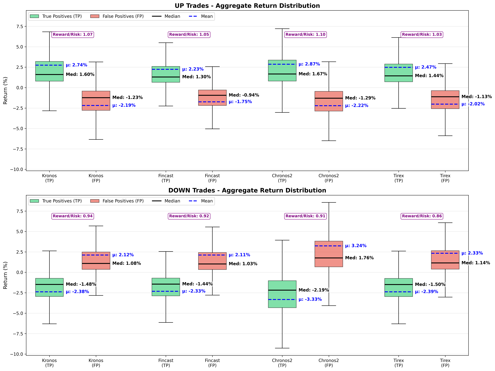

**Split violin plots of TP vs FP returns per model and direction.** Each model bar shows a single violin split into TP (green, left half) and FP (red, right half), with inner quartile lines marking the 25th/50th/75th percentiles. The further apart the TP and FP modes are within a violin, the stronger the discriminative signal the M2 can exploit.

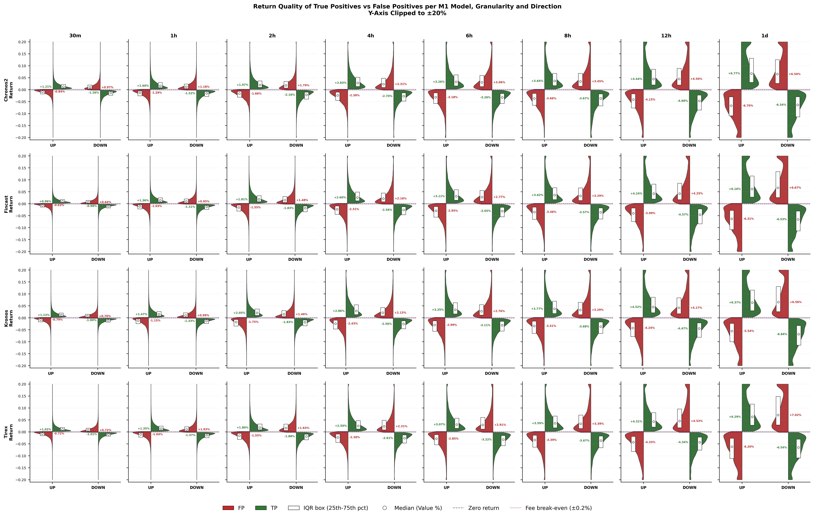

---

### TabPFN — 4h UP Example Run

Diagnostic plots from a representative TabPFN run (Kronos as M1, 4-hour granularity, UP direction), illustrating the full selective classification and backtest pipeline.

**Validation risk-coverage curve.** Plots precision against coverage as the threshold τ is swept from 0.5 to 0.95 on the validation split. The selected τ (marked) is the threshold value on the x-axis that maximizes the coverage-penalized utility while satisfying all acceptance gates. A steep precision gain at low coverage indicates a well-discriminating model.

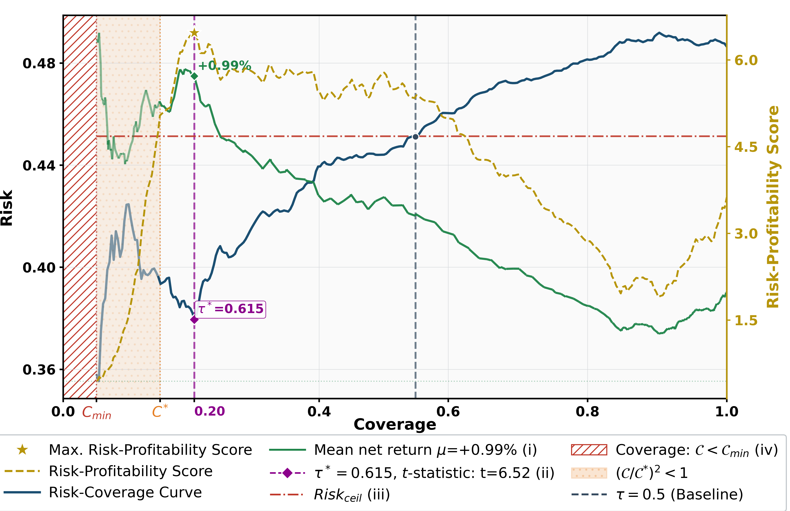

**Test risk-coverage curve.** Same plot applied to the held-out test set using the τ fixed on validation. Consistency between validation and test curves confirms that the threshold generalises out-of-sample rather than overfitting to the validation window.

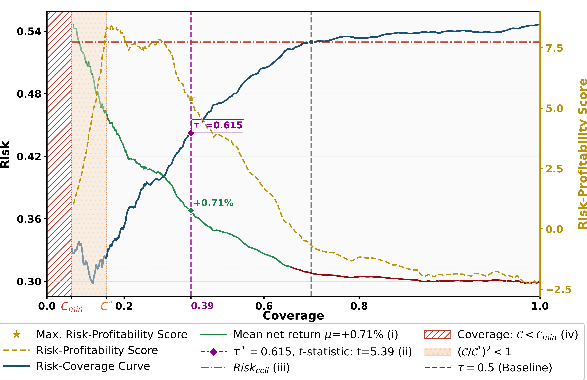

**Test selective return distribution.** Histogram of per-trade returns for accepted trades (those with predicted probability ≥ τ*) on the test set, split by true outcome (TP vs FP). A right-shifted TP distribution with a heavier positive tail compared to FP indicates the classifier is successfully filtering lower-quality trades leading to loss (false positives) and keeping higher-quality trades leading to gain (true positives).

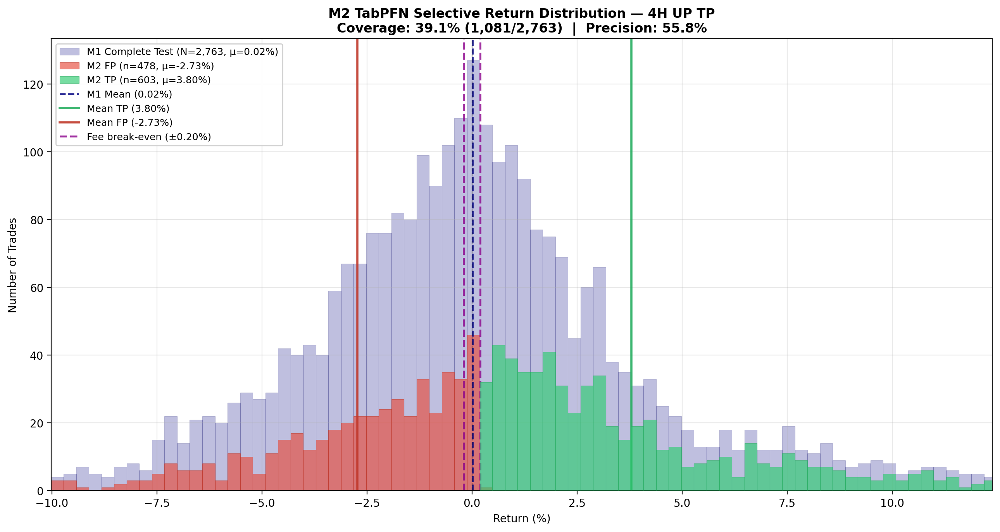

**Combined UP+DOWN backtest equity curve.** Cumulative strategy return over the test period when both UP and DOWN signals are merged into a single portfolio. Shown alongside the buy-and-hold benchmark. Outperformance with lower drawdown validates that the selective classification threshold adds real economic value.

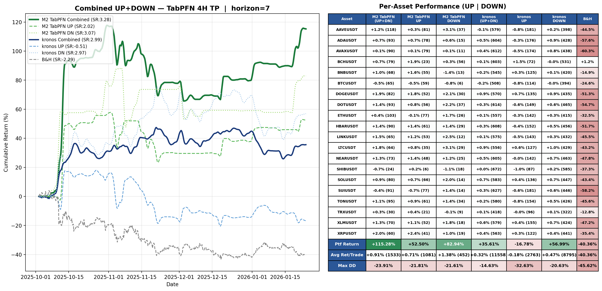

---

The two tables below are the full result tables from the paper's appendix. Columns: RF = Random Forest, AG = AutoGluon, TPFN = TabPFN, TICL = TabICL, CNNT = CNN-Transformer. Each cell shows `↑ / ↓` for UP/DOWN directions. Negative values are shown in <span style="color:red">red</span>. The **Winner** column reports the per-granularity best (M2, Direction) pair, averaged across the four M1 backbones using **pure mean** (no convergence weighting). The bottom **Mean** row averages across all granularities.

---

### Table 1 — Selective Classification Performance (M2 Precision, Δ Precision, Coverage)

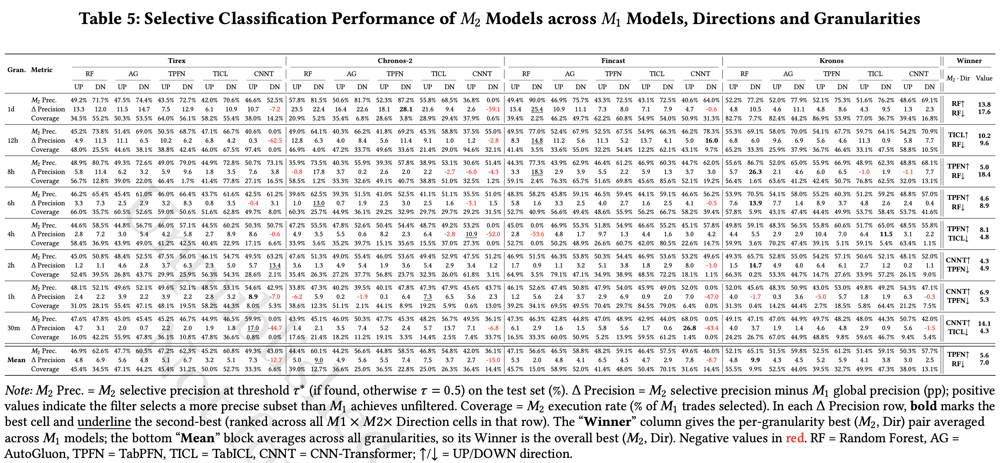

---

### Table 2 — Portfolio Performance (M2 Return, Δ Return, Δ Sharpe, N Trades)

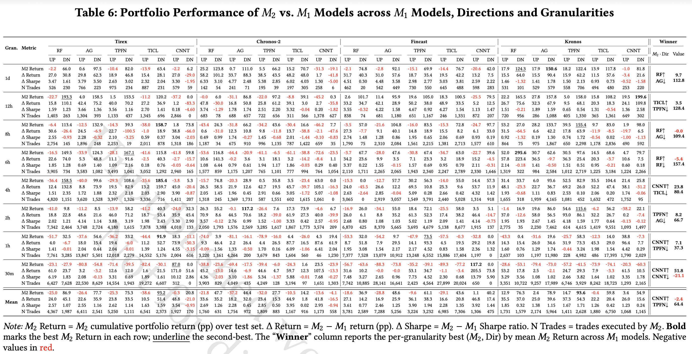

---

<!--
<details>
<summary>Legacy Markdown tables (kept for reference)</summary>

### Table 1 — Selective Classification Performance (M2 Precision, Δ Precision, Coverage)

<details>
<summary>Expand full table</summary>

| Gran. | Metric | TiRex RF | TiRex AG | TiRex TPFN | TiRex TICL | TiRex CNNT | Chronos-2 RF | Chronos-2 AG | Chronos-2 TPFN | Chronos-2 TICL | Chronos-2 CNNT | Fincast RF | Fincast AG | Fincast TPFN | Fincast TICL | Fincast CNNT | Kronos RF | Kronos AG | Kronos TPFN | Kronos TICL | Kronos CNNT | Winner (M2↑/M2↓) | Avg value |
|---|---|---|---|---|---|---|---|---|---|---|---|---|---|---|---|---|---|---|---|---|---|---|---|
| 1d | M2 Prec. | 49.2% / 71.7% | 47.5% / 74.4% | 43.5% / 72.7% | 42.0% / 70.6% | 46.6% / 52.5% | 57.8% / 81.5% | 50.6% / 81.7% | 52.3% / 87.2% | 55.8% / 68.5% | 36.8% / 0.0% | 49.4% / 90.0% | 46.9% / 75.7% | 43.3% / 72.5% | 43.1% / 72.5% | 40.6% / 64.0% | 52.2% / 77.2% | 52.0% / 77.9% | 52.1% / 75.3% | 51.6% / 76.2% | 48.6% / 69.1% | **RF↑ / RF↓** | ↑+52.2 / ↓+80.1 |
|  | Δ Prec. | 13.3 / 12.0 | 11.5 / 14.7 | 7.5 / 12.9 | 6.1 / 10.9 | 10.7 / <span style="color:red">-7.2</span> | 23.5 / 22.4 | 16.4 / 22.6 | 18.1 / 28.1 | 21.6 / 9.4 | 2.6 / <span style="color:red">-59.1</span> | 13.4 / 25.4 | 10.9 / 11.1 | 7.3 / 8.0 | 7.1 / 7.9 | 4.7 / <span style="color:red">-0.6</span> | 4.8 / 10.5 | 4.6 / 11.1 | 4.8 / 8.6 | 4.3 / 9.5 | 1.3 / 2.3 |  |  |
|  | Coverage | 34.5% / 55.2% | 50.3% / 53.5% | 64.0% / 56.1% | 58.2% / 55.4% | 38.0% / 14.2% | 20.9% / 5.2% | 35.4% / 6.8% | 28.6% / 3.8% | 28.9% / 29.4% | 37.9% / 0.6% | 39.4% / 2.2% | 46.2% / 49.7% | 62.2% / 60.8% | 54.9% / 54.0% | 50.9% / 31.3% | 82.7% / 7.7% | 82.4% / 44.2% | 86.9% / 53.9% | 77.0% / 36.7% | 39.4% / 16.8% |  |  |
| 12h | M2 Prec. | 45.2% / 73.8% | 51.4% / 69.0% | 50.5% / 68.7% | 47.1% / 66.7% | 40.6% / 0.0% | 49.0% / 64.1% | 40.3% / 66.2% | 41.8% / 69.2% | 45.3% / 58.8% | 37.5% / 55.0% | 49.5% / 77.0% | 52.4% / 67.9% | 52.5% / 67.5% | 54.9% / 66.3% | 46.2% / 78.3% | 55.3% / 69.1% | 58.0% / 70.0% | 54.1% / 67.7% | 59.7% / 64.1% | 54.2% / 70.9% | **TICL↑ / RF↓** | ↑+51.8 / ↓+71.0 |
|  | Δ Prec. | 4.9 / 11.3 | 11.1 / 6.5 | 10.2 / 6.2 | 6.8 / 4.2 | 0.3 / <span style="color:red">-62.5</span> | 12.8 / 6.3 | 4.0 / 8.4 | 5.6 / 11.4 | 9.1 / 1.0 | 1.2 / <span style="color:red">-2.8</span> | 8.3 / 14.8 | 11.2 / 5.6 | 11.3 / 5.2 | 13.7 / 4.1 | 5.0 / 16.0 | 6.8 / 6.0 | 9.6 / 6.9 | 5.6 / 4.6 | 11.3 / 0.9 | 5.8 / 7.7 |  |  |
|  | Coverage | 48.0% / 25.5% | 44.6% / 38.1% | 38.8% / 42.4% | 46.0% / 67.5% | 97.4% / 0.0% | 46.9% / 4.0% | 47.2% / 33.7% | 49.6% / 33.6% | 21.4% / 29.0% | 94.6% / 32.1% | 41.4% / 3.5% | 33.6% / 55.0% | 32.2% / 54.4% | 12.2% / 62.1% | 43.1% / 9.7% | 65.2% / 33.3% | 25.9% / 37.9% | 36.7% / 46.4% | 33.1% / 47.5% | 58.8% / 10.5% |  |  |
| 8h | M2 Prec. | 48.9% / 80.7% | 49.3% / 72.6% | 49.0% / 79.0% | 44.9% / 72.8% | 50.7% / 73.1% | 35.9% / 73.5% | 40.3% / 55.9% | 39.3% / 57.8% | 38.9% / 53.1% | 30.6% / 51.4% | 44.3% / 77.3% | 43.9% / 62.9% | 46.4% / 61.2% | 46.9% / 60.3% | 44.7% / 62.0% | 55.6% / 86.7% | 52.0% / 65.0% | 55.9% / 66.9% | 48.9% / 62.3% | 48.8% / 68.1% | **TPFN↑ / RF↓** | ↑+47.6 / ↓+79.5 |
|  | Δ Prec. | 5.8 / 11.4 | 6.2 / 3.2 | 5.9 / 9.6 | 1.8 / 3.5 | 7.6 / 3.8 | <span style="color:red">-0.8</span> / 17.8 | 3.7 / 0.2 | 2.6 / 2.0 | 2.2 / <span style="color:red">-2.7</span> | <span style="color:red">-6.0</span> / <span style="color:red">-4.3</span> | 3.3 / 18.3 | 2.9 / 3.9 | 5.5 / 2.2 | 5.9 / 1.3 | 3.7 / 3.0 | 5.7 / 26.3 | 2.1 / 4.6 | 6.0 / 6.5 | <span style="color:red">-1.0</span> / 1.9 | <span style="color:red">-1.1</span> / 7.7 |  |  |
|  | Coverage | 56.7% / 12.8% | 39.0% / 22.0% | 46.4% / 1.7% | 41.4% / 77.8% | 27.1% / 16.5% | 58.5% / 1.2% | 33.3% / 32.6% | 49.1% / 40.7% | 38.8% / 51.0% | 32.5% / 1.2% | 59.1% / 2.4% | 76.3% / 65.7% | 51.6% / 69.8% | 45.6% / 85.6% | 52.1% / 19.2% | 56.4% / 1.6% | 63.6% / 41.2% | 42.4% / 50.7% | 76.8% / 62.5% | 32.0% / 13.1% |  |  |
| 6h | M2 Prec. | 46.2% / 65.4% | 45.4% / 61.0% | 46.0% / 66.4% | 43.7% / 61.6% | 42.5% / 61.2% | 39.6% / 62.5% | 39.3% / 51.5% | 41.0% / 52.5% | 41.1% / 51.1% | 35.5% / 51.0% | 48.3% / 58.2% | 45.8% / 59.1% | 46.5% / 59.4% | 44.1% / 59.1% | 46.6% / 56.2% | 53.9% / 70.5% | 54.1% / 58.0% | 55.2% / 60.3% | 51.2% / 59.2% | 48.8% / 57.0% | **TPFN↑ / RF↓** | ↑+47.2 / ↓+64.2 |
|  | Δ Prec. | 3.3 / 7.3 | 2.5 / 2.9 | 3.2 / 8.3 | 0.8 / 3.5 | <span style="color:red">-0.4</span> / 3.1 | 1.0 / 13.0 | 0.7 / 1.9 | 2.5 / 3.0 | 2.5 / 1.6 | <span style="color:red">-3.1</span> / 1.5 | 5.8 / 1.6 | 3.3 / 2.5 | 4.0 / 2.7 | 1.6 / 2.5 | 4.1 / <span style="color:red">-0.5</span> | 7.6 / 13.9 | 7.7 / 1.4 | 8.9 / 3.7 | 4.8 / 2.6 | 2.4 / 0.4 |  |  |
|  | Coverage | 66.0% / 35.7% | 60.5% / 52.6% | 59.0% / 50.6% | 51.6% / 62.8% | 49.7% / 8.0% | 60.3% / 25.7% | 44.9% / 36.1% | 29.2% / 32.9% | 29.7% / 29.7% | 29.2% / 31.5% | 52.7% / 40.9% | 56.6% / 49.4% | 48.6% / 55.9% | 56.2% / 66.7% | 58.2% / 39.4% | 57.8% / 5.9% | 43.1% / 47.4% | 44.4% / 49.9% | 53.7% / 58.4% | 53.7% / 41.6% |  |  |
| 4h | M2 Prec. | 44.6% / 58.5% | 44.8% / 56.7% | 46.0% / 57.1% | 44.5% / 60.2% | 50.3% / 50.7% | 47.2% / 55.5% | 47.8% / 52.6% | 50.4% / 54.4% | 48.7% / 49.2% | 53.2% / 0.0% | 45.0% / 0.0% | 46.9% / 55.3% | 51.8% / 54.9% | 46.6% / 55.2% | 45.1% / 57.8% | 49.8% / 59.1% | 48.3% / 56.5% | 55.8% / 60.6% | 51.7% / 65.0% | 48.5% / 55.8% | **TPFN↑ / TICL↓** | ↑+51.0 / ↓+57.4 |
|  | Δ Prec. | 2.8 / 7.2 | 3.0 / 5.4 | 4.2 / 5.8 | 2.7 / 8.9 | 8.6 / <span style="color:red">-0.6</span> | 4.9 / 3.5 | 5.5 / 0.6 | 8.2 / 2.3 | 6.4 / <span style="color:red">-2.8</span> | 10.9 / <span style="color:red">-52.0</span> | 2.8 / <span style="color:red">-53.6</span> | 4.8 / 1.7 | 9.7 / 1.3 | 4.4 / 1.6 | 3.0 / 4.2 | 4.4 / 5.5 | 2.9 / 2.9 | 10.4 / 7.0 | 6.4 / 11.5 | 3.1 / 2.2 |  |  |
|  | Coverage | 58.4% / 36.9% | 43.9% / 49.0% | 41.2% / 42.5% | 40.4% / 22.9% | 17.1% / 6.6% | 33.9% / 5.6% | 35.2% / 39.7% | 15.1% / 35.6% | 15.5% / 37.0% | 27.3% / 0.0% | 52.7% / 0.0% | 50.2% / 48.9% | 26.6% / 60.7% | 42.0% / 80.5% | 22.6% / 14.7% | 59.9% / 3.6% | 70.2% / 47.4% | 39.1% / 5.1% | 59.1% / 5.4% | 63.4% / 1.1% |  |  |
| 2h | M2 Prec. | 45.0% / 50.8% | 48.4% / 52.5% | 47.5% / 56.0% | 46.1% / 54.7% | 49.5% / 63.2% | 47.6% / 51.3% | 49.0% / 55.4% | 46.0% / 53.6% | 49.4% / 52.9% | 47.5% / 51.2% | 46.9% / 51.5% | 46.3% / 53.8% | 50.3% / 54.4% | 46.9% / 53.6% | 53.2% / 49.6% | 49.3% / 65.7% | 52.8% / 55.0% | 54.2% / 57.1% | 50.6% / 52.1% | 48.1% / 52.0% | **CNNT↑ / TPFN↓** | ↑+49.6 / ↓+55.3 |
|  | Δ Prec. | 1.2 / 1.1 | 4.6 / 2.8 | 3.7 / 6.3 | 2.3 / 5.0 | 5.7 / 13.4 | 3.6 / 1.3 | 4.9 / 5.4 | 1.9 / 3.6 | 5.4 / 2.9 | 3.4 / 1.2 | 1.7 / 0.9 | 1.1 / 3.2 | 5.1 / 3.8 | 1.8 / 2.9 | 8.0 / <span style="color:red">-1.0</span> | 1.5 / 14.7 | 4.9 / 4.0 | 6.4 / 6.1 | 2.7 / 1.2 | 0.2 / 1.1 |  |  |
|  | Coverage | 52.4% / 39.5% | 26.8% / 43.7% | 29.9% / 25.9% | 56.3% / 54.3% | 28.6% / 2.1% | 35.4% / 26.3% | 27.2% / 37.7% | 56.8% / 23.7% | 32.3% / 26.0% | 61.8% / 3.1% | 64.9% / 3.5% | 79.1% / 47.1% | 34.9% / 38.9% | 48.5% / 72.2% | 18.1% / 1.1% | 66.3% / 0.2% | 53.3% / 44.7% | 14.7% / 27.6% | 33.9% / 57.2% | 26.1% / 9.0% |  |  |
| 1h | M2 Prec. | 48.1% / 52.1% | 49.6% / 52.1% | 49.6% / 52.1% | 48.5% / 53.1% | 54.6% / 42.9% | 33.8% / 47.3% | 40.2% / 39.5% | 40.1% / 47.8% | 47.3% / 47.9% | 45.6% / 43.7% | 46.1% / 52.6% | 47.4% / 50.8% | 47.9% / 54.0% | 45.9% / 49.0% | 52.0% / 0.0% | 52.0% / 45.6% | 48.3% / 50.9% | 43.0% / 53.0% | 49.8% / 49.2% | 54.3% / 47.1% | **CNNT↑ / TPFN↓** | ↑+51.6 / ↓+51.7 |
|  | Δ Prec. | 2.4 / 2.2 | 3.9 / 2.2 | 3.9 / 2.2 | 2.8 / 3.2 | 8.9 / <span style="color:red">-7.0</span> | <span style="color:red">-6.2</span> / 5.9 | 0.2 / <span style="color:red">-1.9</span> | 0.1 / 6.4 | 7.3 / 6.5 | 5.6 / 2.3 | 1.2 / 5.6 | 2.4 / 3.7 | 2.9 / 6.9 | 0.9 / 2.0 | 7.0 / <span style="color:red">-47.0</span> | 4.0 / <span style="color:red">-1.7</span> | 0.3 / 3.6 | <span style="color:red">-5.0</span> / 5.7 | 1.8 / 1.9 | 6.3 / <span style="color:red">-0.3</span> |  |  |
|  | Coverage | 31.0% / 28.1% | 55.4% / 47.1% | 48.1% / 19.5% | 58.2% / 44.3% | 8.0% / 5.3% | 38.6% / 12.3% | 51.1% / 2.1% | 44.1% / 8.9% | 19.2% / 5.9% | 0.6% / 13.0% | 39.2% / 34.1% | 69.5% / 49.5% | 70.4% / 29.7% | 84.5% / 79.0% | 6.4% / 0.0% | 31.3% / 0.4% | 14.2% / 44.4% | 2.7% / 18.5% | 5.8% / 64.4% | 21.2% / 7.5% |  |  |
| 30m | M2 Prec. | 47.6% / 47.8% | 45.0% / 45.4% | 45.2% / 46.7% | 44.9% / 46.5% | 59.9% / 0.0% | 43.9% / 45.1% | 46.0% / 50.3% | 47.7% / 45.3% | 48.2% / 56.7% | 49.5% / 36.1% | 47.3% / 46.3% | 42.8% / 44.8% | 47.0% / 48.9% | 42.9% / 44.0% | 68.0% / 0.0% | 49.1% / 47.1% | 47.0% / 44.9% | 49.7% / 48.2% | 48.0% / 44.3% | 50.7% / 42.0% | **CNNT↑ / TICL↓** | ↑+57.0 / ↓+47.9 |
|  | Δ Prec. | 4.7 / 3.1 | 2.0 / 0.7 | 2.2 / 2.0 | 1.9 / 1.8 | 17.0 / <span style="color:red">-44.7</span> | 1.4 / 2.1 | 3.5 / 7.4 | 5.2 / 2.4 | 5.7 / 13.7 | 7.1 / <span style="color:red">-6.8</span> | 6.1 / 2.9 | 1.6 / 1.5 | 5.8 / 5.6 | 1.7 / 0.6 | 26.8 / <span style="color:red">-43.4</span> | 4.0 / 3.7 | 1.9 / 1.4 | 4.6 / 4.8 | 2.9 / 0.9 | 5.6 / <span style="color:red">-1.5</span> |  |  |
|  | Coverage | 16.0% / 42.2% | 55.9% / 47.8% | 36.1% / 10.8% | 47.8% / 36.6% | 0.8% / 0.0% | 17.6% / 21.4% | 18.2% / 11.2% | 19.1% / 3.3% | 14.4% / 2.5% | 7.4% / 33.7% | 16.5% / 33.3% | 60.0% / 50.9% | 5.2% / 13.9% | 59.5% / 61.2% | 1.4% / 0.0% | 24.2% / 26.7% | 67.0% / 44.9% | 48.8% / 9.8% | 59.6% / 46.7% | 9.4% / 5.4% |  |  |
| **Mean** | M2 Prec. | 46.9% / 62.6% | 47.7% / 60.5% | 47.2% / 62.3% | 45.2% / 60.8% | 49.3% / 43.0% | 44.4% / 60.1% | 44.2% / 56.6% | 44.8% / 58.5% | 46.8% / 54.8% | 42.0% / 36.1% | 47.1% / 56.6% | 46.5% / 58.8% | 48.2% / 59.1% | 46.4% / 57.5% | 49.6% / 46.0% | 52.1% / 65.1% | 51.5% / 59.8% | 52.5% / 61.2% | 51.4% / 59.1% | 50.3% / 57.7% | **TPFN↑ / RF↓** | ↑+48.2 / ↓+61.1 |
|  | Δ Prec. | 4.8 / 6.9 | 5.6 / 4.8 | 5.1 / 6.7 | 3.2 / 5.1 | 7.3 / <span style="color:red">-12.7</span> | 5.0 / 9.0 | 4.9 / 5.6 | 5.5 / 7.4 | 7.5 / 3.7 | 2.7 / <span style="color:red">-15.0</span> | 5.3 / 2.0 | 4.8 / 4.1 | 6.5 / 4.5 | 4.7 / 2.9 | 7.8 / <span style="color:red">-8.7</span> | 4.8 / 9.9 | 4.3 / 4.5 | 5.2 / 5.9 | 4.1 / 3.8 | 3.0 / 2.5 |  |  |
|  | Coverage | 45.4% / 34.5% | 47.1% / 44.2% | 45.4% / 31.2% | 50.0% / 52.7% | 33.3% / 6.6% | 39.0% / 12.7% | 36.6% / 25.0% | 36.5% / 22.8% | 25.0% / 26.3% | 36.4% / 14.4% | 45.7% / 15.0% | 58.9% / 52.0% | 41.4% / 48.0% | 50.4% / 70.1% | 31.6% / 14.4% | 55.5% / 9.9% | 52.5% / 44.0% | 39.5% / 32.7% | 49.9% / 47.3% | 38.0% / 13.1% |  |  |

</details>

---

### Table 2 — Portfolio Performance (M2 Return, Δ Return, Δ Sharpe, N Trades)

<details>
<summary>Expand full table</summary>

| Gran. | Metric | TiRex RF | TiRex AG | TiRex TPFN | TiRex TICL | TiRex CNNT | Chronos-2 RF | Chronos-2 AG | Chronos-2 TPFN | Chronos-2 TICL | Chronos-2 CNNT | Fincast RF | Fincast AG | Fincast TPFN | Fincast TICL | Fincast CNNT | Kronos RF | Kronos AG | Kronos TPFN | Kronos TICL | Kronos CNNT | Winner (M2↑/M2↓) | Avg value |

|---|---|---|---|---|---|---|---|---|---|---|---|---|---|---|---|---|---|---|---|---|---|---|---|
| 1d | M2 Return | <span style="color:red">-2.2</span> / 66.0 | 0.6 / 97.5 | <span style="color:red">-10.4</span> / 82.0 | <span style="color:red">-13.9</span> / 63.4 | <span style="color:red">-2.2</span> / 6.2 | 25.2 / 123.8 | 0.7 / 111.0 | 5.5 / 66.2 | 15.2 / 70.7 | <span style="color:red">-31.3</span> / <span style="color:red">-19.1</span> | <span style="color:red">-2.1</span> / 74.8 | <span style="color:red">-2.8</span> / 92.1 | <span style="color:red">-15.1</span> / 69.9 | <span style="color:red">-14.4</span> / 76.7 | <span style="color:red">-20.6</span> / 42.0 | 17.9 / 124.3 | 17.9 / 150.6 | 18.2 / 122.4 | 13.9 / 117.8 | <span style="color:red">-1.0</span> / 81.8 | **RF↑ / AG↓** | ↑+9.7 / ↓+112.8 |
|  | Δ Return | 27.0 / 30.8 | 29.8 / 62.3 | 18.9 / 46.8 | 15.4 / 28.1 | 27.0 / <span style="color:red">-29.0</span> | 58.2 / 101.2 | 33.7 / 88.3 | 38.5 / 43.5 | 48.2 / 48.0 | 1.7 / <span style="color:red">-41.8</span> | 31.7 / 40.3 | 31.0 / 57.6 | 18.7 / 35.4 | 19.5 / 42.2 | 13.2 / 7.5 | 15.5 / 64.0 | 15.5 / 90.4 | 15.9 / 62.2 | 11.5 / 57.6 | <span style="color:red">-3.4</span> / 21.6 |  |  |
|  | Δ Sharpe | 3.5 / 1.6 | 3.8 / 3.5 | 2.6 / 3.0 | 2.3 / 2.0 | 3.3 / <span style="color:red">-1.9</span> | 6.3 / 3.1 | 4.8 / 2.5 | 5.4 / 2.9 | 6.0 / 4.0 | 1.3 / <span style="color:red">-5.0</span> | 4.5 / 0.3 | 4.5 / 3.6 | 3.0 / 2.8 | 3.0 / 3.8 | 2.6 / 2.2 | 1.5 / <span style="color:red">-1.3</span> | 1.4 / 1.8 | 1.5 / 2.1 | 0.9 / 0.7 | <span style="color:red">-0.5</span> / <span style="color:red">-1.6</span> |  |  |
|  | N Trades | 526 / 230 | 766 / 223 | 975 / 234 | 887 / 231 | 579 / 59 | 142 / 54 | 241 / 71 | 195 / 39 | 197 / 305 | 258 / 6 | 462 / 20 | 542 / 449 | 730 / 550 | 645 / 488 | 598 / 283 | 531 / 101 | 529 / 579 | 558 / 706 | 494 / 480 | 253 / 220 |  |  |
| 12h | M2 Return | <span style="color:red">-22.7</span> / 193.3 | 4.0 / 158.5 | 1.5 / 153.5 | <span style="color:red">-11.2</span> / 120.2 | <span style="color:red">-37.2</span> / 0.0 | 0.0 / 6.0 | <span style="color:red">-31.1</span> / 86.8 | <span style="color:red">-22.0</span> / 97.2 | <span style="color:red">-8.8</span> / 39.1 | <span style="color:red">-45.2</span> / 0.3 | 2.6 / 101.7 | 11.4 / 95.9 | 19.6 / 105.0 | 18.3 / 100.5 | <span style="color:red">-25.5</span> / 79.5 | 22.2 / 165.5 | 27.8 / 157.8 | 5.0 / 158.0 | 15.8 / 108.2 | 19.5 / 199.6 | **TICL↑ / TPFN↓** | ↑+3.5 / ↓+128.4 |
|  | Δ Return | 15.8 / 110.1 | 42.4 / 75.2 | 40.0 / 70.2 | 27.2 / 36.9 | 1.2 / <span style="color:red">-83.3</span> | 47.8 / <span style="color:red">-30.0</span> | 16.8 / 50.8 | 25.8 / 61.2 | 39.1 / 3.0 | 2.7 / <span style="color:red">-35.8</span> | 33.2 / 34.7 | 42.1 / 28.9 | 50.2 / 38.0 | 48.9 / 33.5 | 5.2 / 12.5 | 26.7 / 75.6 | 32.3 / 67.9 | 9.5 / 68.1 | 20.3 / 18.3 | 24.1 / 109.8 |  |  |
|  | Δ Sharpe | 1.6 / 1.2 | 3.7 / 1.4 | 3.6 / 1.2 | 2.7 / 1.4 | 0.2 / <span style="color:red">-4.6</span> | 3.7 / <span style="color:red">-1.3</span> | 1.8 / 1.7 | 2.5 / 2.2 | 3.3 / <span style="color:red">-0.0</span> | 0.2 / <span style="color:red">-1.8</span> | 3.5 / <span style="color:red">-0.3</span> | 4.2 / 1.6 | 4.7 / 0.9 | 4.3 / 1.5 | 1.1 / 1.5 | 1.5 / <span style="color:red">-0.2</span> | 1.9 / 1.6 | 0.7 / 0.5 | 1.3 / <span style="color:red">-0.5</span> | 1.4 / 2.6 |  |  |
|  | N Trades | 1,403 / 263 | 1,304 / 393 | 1,133 / 437 | 1,345 / 696 | 2,846 / 0 | 683 / 78 | 688 / 657 | 722 / 656 | 311 / 566 | 1,378 / 627 | 838 / 74 | 681 / 1,180 | 651 / 1,167 | 246 / 1,331 | 872 / 207 | 720 / 956 | 286 / 1,088 | 405 / 1,330 | 365 / 1,361 | 649 / 302 |  |  |
| 8h | M2 Return | <span style="color:red">-6.4</span> / 113.4 | <span style="color:red">-12.5</span> / 132.9 | <span style="color:red">-14.3</span> / 39.3 | <span style="color:red">-38.0</span> / 158.7 | 1.8 / 73.8 | <span style="color:red">-43.4</span> / 24.3 | <span style="color:red">-31.8</span> / 66.2 | <span style="color:red">-34.2</span> / 43.6 | <span style="color:red">-30.4</span> / 16.6 | <span style="color:red">-46.2</span> / 7.7 | <span style="color:red">-3.5</span> / 57.0 | <span style="color:red">-21.6</span> / 104.8 | <span style="color:red">-16.0</span> / 83.5 | <span style="color:red">-15.3</span> / 72.8 | <span style="color:red">-24.7</span> / 97.7 | 53.2 / 27.0 | 28.2 / 133.7 | 39.5 / 155.4 | 9.7 / 83.0 | 1.9 / 98.0 | **RF↑ / AG↓** | ↑-0.0 / ↓+109.4 |
|  | Δ Return | 30.6 / <span style="color:red">-26.4</span> | 24.5 / <span style="color:red">-6.9</span> | 22.7 / <span style="color:red">-100.5</span> | <span style="color:red">-1.0</span> / 18.9 | 38.8 / <span style="color:red">-66.0</span> | 0.6 / <span style="color:red">-31.0</span> | 12.3 / 10.8 | 9.8 / <span style="color:red">-11.8</span> | 13.7 / <span style="color:red">-38.8</span> | <span style="color:red">-2.1</span> / <span style="color:red">-47.6</span> | 27.3 / <span style="color:red">-7.7</span> | 9.1 / 40.1 | 14.8 / 18.9 | 15.5 / 8.2 | 6.1 / 33.0 | 31.5 / <span style="color:red">-64.5</span> | 6.6 / 42.2 | 17.8 / 63.9 | <span style="color:red">-11.9</span> / <span style="color:red">-8.5</span> | <span style="color:red">-19.7</span> / 6.5 |  |  |
|  | Δ Sharpe | 2.5 / <span style="color:red">-0.9</span> | 2.3 / <span style="color:red">-0.3</span> | 2.1 / <span style="color:red">-3.2</span> | 0.6 / 0.4 | 3.0 / <span style="color:red">-2.0</span> | 0.5 / 1.0 | 1.7 / <span style="color:red">-0.3</span> | 1.4 / <span style="color:red">-0.7</span> | 2.0 / <span style="color:red">-1.4</span> | <span style="color:red">-0.1</span> / <span style="color:red">-0.8</span> | 2.7 / 1.5 | 1.3 / 0.9 | 1.9 / 0.7 | 2.1 / 0.7 | 0.9 / 0.2 | 0.9 / <span style="color:red">-1.3</span> | 0.2 / 1.3 | 0.7 / 1.7 | <span style="color:red">-0.5</span> / 0.0 | <span style="color:red">-1.0</span> / <span style="color:red">-1.1</span> |  |  |
|  | N Trades | 2,754 / 145 | 1,896 / 248 | 2,253 / 19 | 2,011 / 878 | 1,318 / 186 | 1,187 / 34 | 675 / 910 | 996 / 1,135 | 787 / 1,422 | 659 / 35 | 1,790 / 75 | 2,310 / 2,084 | 1,561 / 2,215 | 1,381 / 2,713 | 1,577 / 610 | 864 / 75 | 975 / 1,867 | 650 / 2,298 | 1,178 / 2,836 | 490 / 592 |  |  |
| 6h | M2 Return | <span style="color:red">-16.5</span> / 149.5 | <span style="color:red">-33.9</span> / 124.3 | <span style="color:red">-28.1</span> / 167.1 | <span style="color:red">-41.6</span> / 115.8 | <span style="color:red">-41.8</span> / 59.8 | <span style="color:red">-53.6</span> / 116.8 | <span style="color:red">-64.4</span> / <span style="color:red">-20.9</span> | <span style="color:red">-61.1</span> / <span style="color:red">-6.5</span> | <span style="color:red">-61.1</span> / <span style="color:red">-38.8</span> | <span style="color:red">-72.6</span> / <span style="color:red">-23.5</span> | <span style="color:red">-3.7</span> / 67.7 | <span style="color:red">-28.0</span> / 47.6 | <span style="color:red">-30.8</span> / 67.4 | <span style="color:red">-34.7</span> / 63.0 | <span style="color:red">-22.7</span> / 39.6 | 52.0 / 295.6 | 30.7 / 62.6 | 30.5 / 97.6 | 14.5 / 68.6 | 4.7 / 79.7 | **RF↑ / RF↓** | ↑-5.4 / ↓+157.4 |
|  | Δ Return | 22.6 / 74.0 | 5.3 / 48.8 | 11.1 / 91.6 | <span style="color:red">-2.5</span> / 40.3 | <span style="color:red">-2.7</span> / <span style="color:red">-15.7</span> | 10.6 / 141.3 | <span style="color:red">-0.2</span> / 3.6 | 3.1 / 18.1 | 3.2 / <span style="color:red">-14.2</span> | <span style="color:red">-8.4</span> / 1.1 | 34.2 / 23.6 | 9.9 / 3.5 | 7.1 / 23.3 | 3.2 / 18.9 | 15.2 / <span style="color:red">-4.5</span> | 57.8 / 223.4 | 36.5 / <span style="color:red">-9.7</span> | 36.3 / 25.4 | 20.3 / <span style="color:red">-3.7</span> | 10.6 / 7.5 |  |  |
|  | Δ Sharpe | 1.9 / 1.3 | 0.7 / 1.4 | 1.1 / 2.2 | 0.2 / 0.8 | <span style="color:red">-0.0</span> / <span style="color:red">-0.6</span> | 1.1 / 6.4 | 0.8 / 0.6 | 1.9 / 1.2 | 1.9 / <span style="color:red">-0.0</span> | 0.3 / 0.4 | 3.4 / 0.2 | 1.6 / <span style="color:red">-0.1</span> | 1.6 / 0.7 | 0.9 / 0.7 | 2.1 / <span style="color:red">-0.3</span> | 2.1 / <span style="color:red">-0.2</span> | 1.4 / <span style="color:red">-0.5</span> | 1.5 / 0.5 | 0.9 / <span style="color:red">-0.2</span> | 0.6 / 0.2 |  |  |
|  | N Trades | 3,905 / 734 | 3,583 / 1,082 | 3,493 / 1,041 | 3,052 / 1,292 | 2,940 / 165 | 1,577 / 859 | 1,175 / 1,207 | 765 / 1,101 | 777 / 994 | 764 / 1,054 | 2,110 / 1,711 | 2,265 / 2,065 | 1,943 / 2,340 | 2,247 / 2,789 | 2,330 / 1,646 | 1,319 / 322 | 984 / 2,584 | 1,012 / 2,719 | 1,225 / 3,184 | 1,224 / 2,266 |  |  |
| 4h | M2 Return | <span style="color:red">-36.4</span> / 158.5 | <span style="color:red">-40.0</span> / 99.6 | <span style="color:red">-29.3</span> / 108.6 | <span style="color:red">-35.6</span> / 185.4 | <span style="color:red">-3.8</span> / 5.3 | <span style="color:red">-15.7</span> / 74.8 | <span style="color:red">-20.3</span> / 28.9 | 0.5 / 35.8 | 3.5 / <span style="color:red">-23.4</span> | 63.0 / 0.0 | <span style="color:red">-15.3</span> / 0.0 | <span style="color:red">-12.7</span> / 57.7 | 30.2 / 56.3 | <span style="color:red">-14.0</span> / 55.0 | 14.4 / 57.3 | 31.4 / 33.7 | 6.0 / 93.6 | 52.5 / 82.9 | 35.5 / 104.4 | 21.4 / 25.8 | **CNNT↑ / TICL↓** | ↑+23.8 / ↓+80.3 |
|  | Δ Return | 12.4 / 132.8 | 8.8 / 73.9 | 19.5 / 82.9 | 13.2 / 159.7 | 45.0 / <span style="color:red">-20.4</span> | 26.5 / 58.5 | 21.9 / 12.6 | 42.7 / 19.5 | 45.7 / <span style="color:red">-39.7</span> | 105.1 / <span style="color:red">-16.3</span> | 24.0 / <span style="color:red">-45.5</span> | 26.6 / 12.2 | 69.5 / 10.8 | 25.3 / 9.6 | 53.7 / 11.9 | 48.1 / <span style="color:red">-23.3</span> | 22.7 / 36.7 | 69.2 / 26.0 | 52.2 / 47.4 | 38.1 / <span style="color:red">-31.2</span> |  |  |
|  | Δ Sharpe | 1.5 / 2.4 | 1.7 / 1.9 | 2.3 / 2.2 | 2.0 / 2.9 | 3.9 / <span style="color:red">-0.9</span> | 2.0 / 1.4 | 2.0 / 0.5 | 2.9 / 0.7 | 3.0 / <span style="color:red">-1.7</span> | 5.1 / <span style="color:red">-1.1</span> | 2.6 / <span style="color:red">-2.6</span> | 2.9 / <span style="color:red">-0.0</span> | 5.1 / 0.3 | 2.7 / 0.4 | 4.3 / 1.4 | 1.9 / <span style="color:red">-0.7</span> | 1.1 / 0.8 | 2.5 / 0.1 | 2.1 / 0.2 | 1.7 / <span style="color:red">-0.1</span> |  |  |
|  | N Trades | 4,820 / 1,151 | 3,620 / 1,528 | 3,397 / 1,326 | 3,336 / 716 | 1,411 / 207 | 1,318 / 245 | 1,369 / 1,731 | 587 / 1,551 | 602 / 1,615 | 1,061 / 0 | 3,065 / 0 | 2,919 / 3,057 | 1,549 / 3,791 | 2,440 / 5,028 | 1,314 / 918 | 1,655 / 318 | 1,939 / 4,165 | 1,081 / 452 | 1,632 / 472 | 1,752 / 95 |  |  |
| 2h | M2 Return | <span style="color:red">-41.0</span> / 9.8 | <span style="color:red">-11.2</span> / 8.5 | <span style="color:red">-13.9</span> / 58.2 | <span style="color:red">-41.2</span> / 40.3 | <span style="color:red">-24.0</span> / 32.3 | 26.3 / 55.2 | <span style="color:red">-0.1</span> / 117.2 | <span style="color:red">-26.4</span> / 7.6 | 17.3 / 73.9 | <span style="color:red">-4.6</span> / 6.7 | <span style="color:red">-16.9</span> / 26.0 | <span style="color:red">-34.1</span> / 55.0 | 18.4 / 72.1 | <span style="color:red">-25.5</span> / 58.0 | 3.5 / 5.1 | <span style="color:red">-1.4</span> / 16.9 | 19.6 / 86.0 | 54.6 / 115.6 | <span style="color:red">-6.2</span> / 56.2 | <span style="color:red">-38.2</span> / 22.1 | **TPFN↑ / AG↓** | ↑+8.2 / ↓+66.7 |
|  | Δ Return | 18.8 / 22.8 | 48.6 / 21.6 | 46.0 / 71.2 | 18.7 / 53.4 | 35.9 / 45.4 | 70.9 / 8.6 | 44.5 / 70.6 | 18.2 / <span style="color:red">-39.0</span> | 61.9 / 27.3 | 40.0 / <span style="color:red">-39.9</span> | 26.0 / 6.1 | 8.8 / 35.2 | 61.3 / 52.3 | 17.4 / 38.2 | 46.4 / <span style="color:red">-14.7</span> | 37.0 / <span style="color:red">-12.6</span> | 58.0 / 56.5 | 93.0 / 86.1 | 32.2 / 26.7 | 0.2 / <span style="color:red">-7.4</span> |  |  |
|  | Δ Sharpe | 2.0 / 1.2 | 4.1 / 1.1 | 3.9 / 3.2 | 2.0 / 2.4 | 3.3 / 2.9 | 3.6 / <span style="color:red">-0.1</span> | 2.8 / 1.0 | 1.5 / <span style="color:red">-1.0</span> | 3.3 / 0.4 | 2.6 / <span style="color:red">-0.9</span> | 2.7 / 0.8 | 1.1 / 1.0 | 5.0 / 1.2 | 2.1 / 1.4 | 4.1 / <span style="color:red">-0.7</span> | 1.9 / 1.9 | 2.7 / 1.4 | 4.2 / 1.6 | 1.8 / 0.6 | <span style="color:red">-0.1</span> / <span style="color:red">-0.1</span> |  |  |
|  | N Trades | 7,342 / 2,464 | 3,748 / 2,724 | 4,180 / 1,615 | 7,878 / 3,388 | 4,010 / 133 | 2,050 / 1,793 | 1,576 / 2,569 | 3,285 / 1,617 | 1,867 / 1,773 | 3,574 / 209 | 6,870 / 425 | 8,370 / 5,665 | 3,693 / 4,679 | 5,138 / 8,677 | 1,915 / 137 | 2,775 / 35 | 2,230 / 7,462 | 614 / 4,615 | 1,419 / 9,551 | 1,093 / 1,497 |  |  |
| 1h | M2 Return | <span style="color:red">-51.7</span> / 32.5 | <span style="color:red">-37.6</span> / 54.6 | <span style="color:red">-36.2</span> / 33.2 | <span style="color:red">-44.4</span> / 91.9 | 18.3 / <span style="color:red">-11.1</span> | <span style="color:red">-74.0</span> / 3.9 | <span style="color:red">-81.1</span> / <span style="color:red">-16.1</span> | <span style="color:red">-78.9</span> / <span style="color:red">-16.0</span> | 4.4 / <span style="color:red">-26.0</span> | 4.3 / 19.4 | <span style="color:red">-53.3</span> / 32.0 | <span style="color:red">-54.2</span> / 9.7 | <span style="color:red">-47.9</span> / 73.5 | <span style="color:red">-57.5</span> / <span style="color:red">-0.3</span> | <span style="color:red">-32.8</span> / 0.0 | <span style="color:red">-43.3</span> / 0.4 | <span style="color:red">-31.6</span> / 19.6 | <span style="color:red">-25.7</span> / 58.3 | <span style="color:red">-12.3</span> / 14.0 | 38.8 / <span style="color:red">-7.3</span> | **CNNT↑ / TPFN↓** | ↑+7.2 / ↓+37.2 |
|  | Δ Return | 4.0 / <span style="color:red">-6.7</span> | 18.0 / 15.4 | 19.4 / <span style="color:red">-6.0</span> | 11.2 / 52.7 | 73.9 / <span style="color:red">-50.3</span> | 9.3 / 46.4 | 2.2 / 26.4 | 4.4 / 26.5 | 87.7 / 16.5 | 87.6 / 61.9 | 8.7 / 51.8 | 7.9 / 29.5 | 14.1 / 93.3 | 4.5 / 19.5 | 29.2 / 19.8 | 14.3 / 15.4 | 26.0 / 34.6 | 31.9 / 73.3 | 45.3 / 29.0 | 96.4 / 7.7 |  |  |
|  | Δ Sharpe | 1.4 / <span style="color:red">-0.0</span> | 2.0 / 0.4 | 2.0 / <span style="color:red">-0.0</span> | 1.4 / 1.2 | 4.5 / <span style="color:red">-3.1</span> | <span style="color:red">-0.1</span> / 1.6 | 1.3 / <span style="color:red">-0.5</span> | 1.7 / 0.2 | 6.1 / <span style="color:red">-1.1</span> | 6.4 / 2.0 | 1.9 / 3.1 | 1.5 / 2.2 | 2.2 / 4.5 | 0.8 / 1.6 | 2.4 / 1.3 | 1.6 / 0.8 | 1.3 / 1.7 | <span style="color:red">-0.4</span> / 3.2 | 2.0 / 1.5 | 4.4 / 0.3 |  |  |
|  | N Trades | 7,761 / 3,285 | 13,847 / 5,501 | 12,018 / 2,279 | 14,552 / 5,176 | 2,004 / 616 | 3,220 / 1,161 | 4,264 / 200 | 3,679 / 843 | 1,604 / 560 | 46 / 1,230 | 7,377 / 7,528 | 13,079 / 10,912 | 13,248 / 6,552 | 15,886 / 17,404 | 1,197 / 0 | 2,637 / 103 | 1,197 / 11,980 | 228 / 4,982 | 486 / 17,393 | 1,790 / 2,029 |  |  |
| 30m | M2 Return | <span style="color:red">-23.1</span> / <span style="color:red">-27.9</span> | <span style="color:red">-80.8</span> / <span style="color:red">-54.8</span> | <span style="color:red">-71.4</span> / <span style="color:red">-39.5</span> | <span style="color:red">-82.4</span> / <span style="color:red">-30.1</span> | 87.0 / 0.0 | <span style="color:red">-38.8</span> / <span style="color:red">-23.6</span> | <span style="color:red">-69.4</span> / <span style="color:red">-17.5</span> | <span style="color:red">-39.4</span> / <span style="color:red">-6.0</span> | <span style="color:red">-24.3</span> / 1.6 | 23.5 / <span style="color:red">-23.9</span> | <span style="color:red">-56.7</span> / <span style="color:red">-63.6</span> | <span style="color:red">-88.3</span> / <span style="color:red">-73.8</span> | <span style="color:red">-35.2</span> / <span style="color:red">-39.1</span> | <span style="color:red">-89.3</span> / <span style="color:red">-77.2</span> | 117.2 / 0.0 | <span style="color:red">-28.6</span> / <span style="color:red">-53.1</span> | <span style="color:red">-79.4</span> / <span style="color:red">-73.0</span> | <span style="color:red">-57.2</span> / <span style="color:red">-41.5</span> | <span style="color:red">-73.9</span> / <span style="color:red">-74.1</span> | <span style="color:red">-20.3</span> / <span style="color:red">-60.3</span> | **CNNT↑ / CNNT↓** | ↑+51.8 / ↓-21.0 |
|  | Δ Return | 61.0 / 23.7 | 3.2 / <span style="color:red">-3.2</span> | 12.6 / 12.0 | 1.6 / 21.5 | 171.0 / 51.6 | 45.2 / <span style="color:red">-13.0</span> | 14.6 / <span style="color:red">-6.9</span> | 44.6 / 4.7 | 59.7 / 12.3 | 107.5 / <span style="color:red">-13.3</span> | 31.6 / 10.2 | 0.0 / 0.0 | 53.1 / 34.7 | <span style="color:red">-1.1</span> / <span style="color:red">-3.4</span> | 205.5 / 73.8 | 53.2 / 17.8 | 2.5 / <span style="color:red">-2.1</span> | 24.7 / 29.3 | 7.9 / <span style="color:red">-3.3</span> | 61.5 / 10.5 |  |  |
|  | Δ Sharpe | 6.2 / 1.8 | 2.1 / <span style="color:red">-0.1</span> | 3.3 / 0.7 | 1.9 / 1.6 | 10.1 / 2.9 | 4.4 / <span style="color:red">-2.0</span> | 3.1 / <span style="color:red">-1.9</span> | 5.3 / <span style="color:red">-1.4</span> | 5.9 / <span style="color:red">-0.0</span> | 7.7 / <span style="color:red">-0.3</span> | 7.5 / 3.3 | 2.6 / 1.0 | 7.7 / 4.5 | 2.3 / 0.7 | 13.8 / 5.9 | 3.3 / 3.6 | 1.1 / 1.0 | 2.7 / 3.8 | 1.6 / 1.0 | 3.4 / 1.8 |  |  |
|  | N Trades | 6,427 / 7,628 | 22,530 / 8,629 | 14,554 / 1,943 | 19,272 / 6,607 | 312 / 0 | 3,903 / 829 | 4,049 / 435 | 4,249 / 128 | 3,194 / 97 | 1,651 / 1,303 | 7,742 / 10,885 | 28,141 / 16,641 | 2,423 / 4,564 | 27,899 / 20,024 | 650 / 0 | 3,351 / 10,722 | 9,257 / 17,989 | 6,746 / 3,929 | 8,242 / 18,723 | 1,293 / 2,165 |  |  |
| **Mean** | M2 Return | <span style="color:red">-25.0</span> / 86.9 | <span style="color:red">-26.4</span> / 77.7 | <span style="color:red">-25.3</span> / 75.3 | <span style="color:red">-38.6</span> / 93.2 | <span style="color:red">-0.3</span> / 20.8 | <span style="color:red">-21.8</span> / 47.7 | <span style="color:red">-37.2</span> / 44.4 | <span style="color:red">-32.0</span> / 27.7 | <span style="color:red">-10.5</span> / 14.2 | <span style="color:red">-13.6</span> / <span style="color:red">-4.1</span> | <span style="color:red">-18.6</span> / 36.9 | <span style="color:red">-28.8</span> / 48.6 | <span style="color:red">-9.6</span> / 61.1 | <span style="color:red">-29.1</span> / 43.6 | 1.1 / 40.2 | 12.9 / 76.3 | 2.4 / 78.9 | 14.7 / 93.6 | <span style="color:red">-0.4</span> / 59.8 | 3.4 / 54.9 | **CNNT↑ / TPFN↓** | ↑-2.4 / ↓+64.4 |
|  | Δ Return | 24.0 / 45.1 | 22.6 / 35.9 | 23.8 / 33.5 | 10.5 / 51.4 | 48.8 / <span style="color:red">-21.0</span> | 33.6 / 35.2 | 18.2 / 32.0 | 23.4 / 15.3 | 44.9 / 1.8 | 41.8 / <span style="color:red">-16.5</span> | 27.1 / 14.2 | 16.9 / 25.9 | 36.1 / 38.3 | 16.6 / 20.8 | 46.8 / 17.4 | 35.5 / 37.0 | 25.0 / 39.6 | 37.3 / 54.3 | 22.2 / 20.4 | 26.0 / 15.6 |  |  |
|  | Δ Sharpe | 2.6 / 1.1 | 2.5 / 1.2 | 2.6 / 1.1 | 1.6 / 1.6 | 3.5 / <span style="color:red">-0.9</span> | 2.7 / 1.3 | 2.3 / 0.5 | 2.9 / 0.5 | 4.0 / 0.0 | 2.9 / <span style="color:red">-0.9</span> | 3.6 / 0.8 | 2.5 / 1.2 | 3.9 / 1.9 | 2.3 / 1.4 | 3.9 / 1.4 | 1.9 / 0.3 | 1.4 / 1.1 | 1.7 / 1.7 | 1.3 / 0.4 | 1.2 / 0.2 |  |  |
|  | N Trades | 4,367 / 1,987 | 6,411 / 2,541 | 5,250 / 1,111 | 6,541 / 2,373 | 1,927 / 170 | 1,760 / 631 | 1,754 / 972 | 1,809 / 883 | 1,167 / 916 | 1,173 / 558 | 3,781 / 2,589 | 7,288 / 5,256 | 3,224 / 3,232 | 6,985 / 7,306 | 1,306 / 475 | 1,731 / 1,579 | 2,174 / 5,964 | 1,411 / 2,628 | 1,880 / 6,750 | 1,068 / 1,145 |  |  |

</details>

</details>
-->

## One-Line Summary

This repository is a modular M2 research workspace for tree-based meta-label filtering, selective-classification with utility-based threshold optimization, backtesting, and comparison reporting, all driven by `config.yaml` and organized as a clean `Utils/` package tree.
