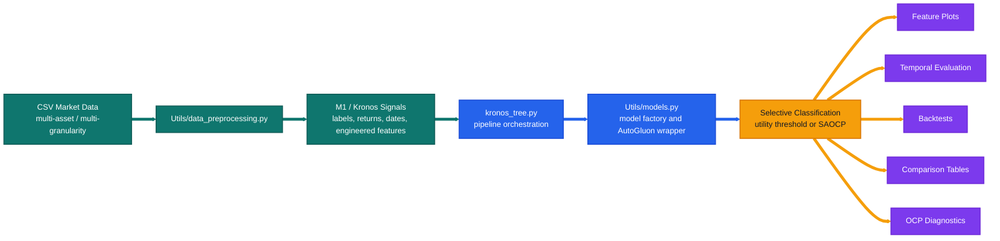
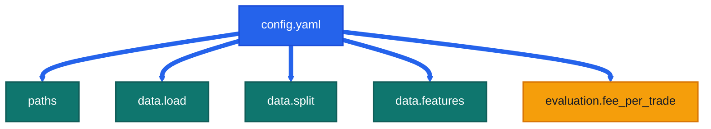
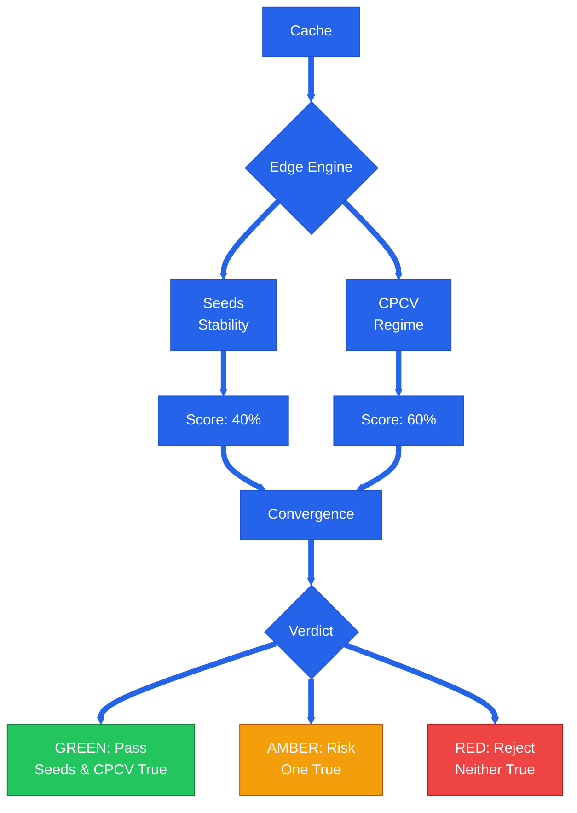

# Secondary-Model

<p align="center">
  
  
  
  
  
</p>

> Current `src/` workspace for the Secondary Model of the Meta-Labeling architecture, which operates on top of financial foundation models: **Kronos** and **Fincast**.
> This README documents the modular tree-based M2 stack around `kronos_tree.py` and its dedicated configuration suite (`config_kronos.yaml` and `config_fincast.yaml`).

<table>
  <tr>
    <td bgcolor="#ccfbf1"><strong>Main Entry</strong><br /><code>kronos_tree.py</code></td>
    <td bgcolor="#dbeafe"><strong>Model Registry</strong><br /><code>Utils/models.py</code></td>
    <td bgcolor="#dbeafe"><strong>Primary Config</strong><br /><code>config.yaml</code></td>
    <td bgcolor="#fef3c7"><strong>Outputs</strong><br /><code>src/Output/</code></td>
    <td bgcolor="#ede9fe"><strong>OCP Diagnostics</strong><br /><code>Utils/ocp_analysis.py</code></td>
  </tr>
</table>

---

## Visual Overview

<p>
  
  
  
  
  
</p>





---

## Core Architecture: Calibration-First

The pipeline follows a strict **Calibration-First** architecture designed to eliminate data leakage and ensure statistical validity in financial meta-labeling.

### 1. The 4-Way Splitting Protocol
Unlike standard Train/Test splits, our workflow enforces a 4-tuple boundary to isolate model fitting, probability calibration, and threshold optimization.


| Window | Subset | Purpose |
| --- | --- | --- |
| **Train** | Training | Fitting the base classifier (RF, XGBoost, or TabPFN). |
| **Val-Cal** | Calibration | Fitting the probability calibrator (Isotonic Regression or Platt Scaling). |
| **Val-Opt** | Optimization | Searching for the optimal financial utility threshold (Selective Classification). |
| **Test** | Evaluation | Final, isolated out-of-sample backtest and performance monitoring. |

### 2. Leakage Elimination & Embargo
We enforce **Temporal Embargoes** at every boundary. A purge window (based on the forecast horizon) is removed between `Train`, `Val`, and `Test` sets to prevent information leakage from overlapping labels in the financial time series.

---

## Codebase Description

## Model Registry: Expanding Beyond Trees

The pipeline supports a diverse registry of classifiers, ranging from classical ensemble methods to state-of-the-art foundation models.

### 1. Ensemble Tree Models
- **Random Forest (`rf`)**: Our canonical baseline. Favored for its robustness and used to compute **OOB (Out-of-Bag) predictions** for streamlined calibration.
- **XGBoost (`xgboost`)**: High-efficiency gradient boosting, optimized for capturing non-linear relationships in noisy financial features.

### 2. Auto Gluon (`autogluon`)
An automated ML suite that performs multi-layer stacking and ensembling (Trees, KNN, Linear Models) to find the most performant architecture for a given asset/granularity within a specified time budget.

### 3. TabPFN (Prior-Data Fitted Networks)
We've integrated **TabPFN**, a state-of-the-art foundation model for tabular data. It uses an In-Context Learning (ICL) approach, where a Transformer is pre-trained on synthetic datasets to perform zero-shot classification in a single forward pass.
- **Reference**: [PriorLabs/TabPFN](https://github.com/PriorLabs/TabPFN)
- **Zero-Shot (`tabpfn`)**: Uses the pre-trained prior directly. Extremely fast and robust on small financial datasets.
- **Fine-Tuned (`tabpfn_ft`)**: Leverages gradient-based fine-tuning to adapt to specific market distributions and sharpen probability calibration.

---

## Edge Convergence: The Gate Keeper

Model performance on a single test set is often a "lucky" snapshot. The **Edge Analysis** suite (`Utils/edge.py`) provides a statistically robust protocol to determine if a model is truly ready for deployment.

### The Principle of Convergence
A model is considered "Converged" only if it passes two independent stress tests:
1. **Regime Sensitivity (CPCV)**: Does the model hold up when the market regime shifts (e.g., from Bull to Bear)?
2. **Model Stability (Seeds)**: Is the model's "alpha" stable, or is it just noise from a lucky random seed?



---

## Current Project Map

<p>
  
  
  
  
</p>

| Path | Role |
| --- | --- |
| `config_kronos.yaml` | Runtime configuration for the **Kronos** foundation path (paths, dates, features). |
| `config_fincast.yaml` | Runtime configuration for the **Fincast** foundation path. |
| `kronos_tree.py` | Main M2 analysis entrypoint; orchestrates 4-way splits, training, evaluation, and selective backtesting. |
| `Utils/models.py` | Central model factory supporting `rf`, `xgboost`, `autogluon`, and `tabpfn_ft`. Includes model-info export helpers. |
| `Utils/edge.py` | **The Gate Keeper**: Stability engine (seeds) and regime-sensitivity analysis (CPCV). Computes the final Edge Convergence Score. |
| `Utils/data_preprocessing.py` | Dataset loading, multi-asset assembly, multi-granularity wrapping, chronological splitting, and embargo/purge logic. |
| `Utils/features.py` | Feature plots, feature ranking, confusion matrices, return histograms, and probability diagnostics. |
| `Utils/backtest.py` | Backtest helpers, equity construction, Sharpe / drawdown, and reporting. |
| `Utils/comparison.py` | Separate-vs-unified and cross-paradigm comparison builders. |
| `Utils/ocp_analysis.py` | Practical OCP diagnostics for completed result folders. |
| `Utils/saocp.py` | Strongly Adaptive Online Conformal Prediction logic. |
| `Data_MLA/` | Kronos-oriented dataset assets and technical indicator computation. |

---

## Run Guide

<p>
  
  
  
</p>

### `kronos_tree.py`: Analysis Pipeline
The primary analysis orchestrator. All runs now utilize the **Calibration-First** workflow.

| Use Case | Command |
| --- | --- |
| **Kronos (Default)** | `python kronos_tree.py --config config_kronos.yaml --per-gran` |
| **Fincast (Foundation)** | `python kronos_tree.py --config config_fincast.yaml --per-gran` |
| **TabPFN on Fincast** | `python kronos_tree.py --config config_fincast.yaml --model tabpfn_ft` |

### `Utils/edge.py`: Convergence Protocol
The final check before model deployment. Runs combinatorial stress tests. Support for both foundation paths via `--config`.

| Mode | Command (Fincast Example) |
| --- | --- |
| **Seeds** | `python Utils/edge.py --config config_fincast.yaml --mode seeds --trials 100` |
| **CPCV** | `python Utils/edge.py --config config_fincast.yaml --mode cpcv --n-blocks 6` |
| **Convergence** | `python Utils/edge.py --config config_fincast.yaml --convergence` |

#### Example Convergence Chain:
```bash
python Utils/edge.py --cache your_cache.pt --mode seeds --model randforest --trials 100
python Utils/edge.py --cache your_cache.pt --mode cpcv --model randforest --n-blocks 6
python Utils/edge.py --cache your_cache.pt --convergence --model randforest
```

---

Important constraint:

- `--top5 true` requires `--features true`
- The actual model objects used by `--model` are now built in `Utils/models.py`

### `features.py`: No Standalone CLI

`Utils/features.py` is a support module, not a script with its own CLI. In normal usage it is reached indirectly through `kronos_tree.py` when feature analysis is enabled.

### `comparison.py`: No Standalone CLI

`Utils/comparison.py` is also a library module. The usual way to use it is through:

- `python kronos_tree.py --comparison ...`
- `python kronos_tree.py --paradigm-comparison ...`

There is no standalone `python Utils/comparison.py ...` workflow documented for normal use.

---

## Outputs

<p>
  
  
  
</p>

Current output root:

```text
src/Output/
```

Current on-disk hierarchy:

```text
src/Output/
├── Analysis/
│   ├── Theory/
│   │   ├── ExperimentA/
│   │   ├── ExperimentB/
│   │   ├── ExperimentC/
│   │   ├── ExperimentD/
│   │   ├── ExperimentE/
│   │   ├── ExperimentF/
│   │   ├── ExperimentG/
│   │   ├── ExperimentH/
│   │   └── ExperimentI/
│   └── Uncertainty/
│       ├── All/
│       ├── Per_Granularity/
│       └── Probe/
└── Kronos/
    ├── autogluon/
    │   ├── DOWN/
    │   │   ├── OCP/
    │   │   └── Utility_Score/
    │   └── UP/
    │       ├── OCP/
    │       └── Utility_Score/
    ├── cache/
    └── randforest/
        ├── DOWN/
        │   ├── OCP/
        │   └── Utility_Score/
        └── UP/
            ├── OCP/
            └── Utility_Score/
```

How to read this structure:

- `src/Output/Kronos/` is the active result tree for the current M2 workflow.
- `src/Output/Kronos/cache/` stores dataset caches used by `kronos_tree.py`.
- `src/Output/Kronos/autogluon/` and `src/Output/Kronos/randforest/` currently hold model-family result folders split by `UP` and `DOWN`.
- `src/Output/Analysis/` keeps older theory and uncertainty-study outputs that are still present on disk but are not the main target of the current Kronos tree workflow.
- Additional model-family folders, such as `xgboost/`, appear here when those runs are generated.

---

## Configuration Examples

<p>
  
  
  
</p>

The project uses two primary configuration files Sharing the same schema. Below is a snapshot of `config_kronos.yaml`.

```yaml
# ━━━━━━━━━━━━━━━━━━━━━━━━━━━━━━━━━━━━━━━━━━━━━━━━━━━━━━━━━━━━━━━━━━━━━━━
# Kronos Tree Configuration
# ━━━━━━━━━━━━━━━━━━━━━━━━━━━━━━━━━━━━━━━━━━━━━━━━━━━━━━━━━━━━━━━━━━━━━━━

# ┏━━━━━━━━━━ Paths ━━━━━━━━━━┓
paths:
  csv_dir: "/home/pablo/M2_DS/Secondary-Model/src/Data_MLA/Kronos/Crypto/TP/horizon_7"
  output_root: "/home/pablo/M2_DS/Secondary-Model/src/Output"

# ┏━━━━━━━━━━ Data Configuration ━━━━━━━━━━┓
data:
  load:
    symbol:          null          # or null for multi-asset or ["BTC", "ETH", "XRP", ...]
    target_col:      "meta_label"  # "meta_label" or "close" or "ground_truth"
    meta_label_mode: "tp"          # "fp" or "tp" or "og"
    direction:       "down"        # "up" or "down"
    granularity:     "all"         # "1d", "4h", etc. or "all" for multi-granularity
    forecast_horizon: 7
    m1: "fincast"

  # ┏━━━━━━━━━━ Data Splits ━━━━━━━━━━┓
  split:
    start_date: "2024-07-01"
    train_end:  "2025-05-30"
    val_end:    "2025-10-01"
    end_date:   "2026-01-25"
    context_length: 90

  # ┏━━━━━━━━━━ Features ━━━━━━━━━━┓
  features:
    input: ["open", "high", "low", "close", "volume"]

    # ┏━━━━━━━━━━ Engineered Window Features ━━━━━━━━━━┓
    engineered_features:
      selected: [bb_pctb_last, rsi_last, roc_5_last, roc_20_last, atr_norm_last]

# ┏━━━━━━━━━━ Evaluation ━━━━━━━━━━┓
evaluation:
  fee_per_trade: 0.002
```

---

## `config.yaml` Parameter Meanings

<p>
  
  
  
  
</p>

### `paths`

| Key | Current value | Meaning |
| --- | --- | --- |
| `paths.csv_dir` | `/home/pablo/M2_DS/Secondary-Model/src/Data_MLA/Kronos/Crypto/TP/horizon_7` | Root directory containing the processed Kronos CSV files consumed by the M2 pipeline. |
| `paths.output_root` | `/home/pablo/M2_DS/Secondary-Model/src/Output` | Base output directory. Artifacts are then written under the configured M1 bucket, e.g. `Output/Fincast` or `Output/Kronos`. |

### `data.load`

| Key | Current value | Meaning |
| --- | --- | --- |
| `data.load.symbol` | `null` | `null` means multi-asset loading. If set to a symbol or symbol list, loading becomes asset-specific. |
| `data.load.target_col` | `meta_label` | Which target column the M2 classifier learns to predict. |
| `data.load.meta_label_mode` | `tp` | Which meta-label variant to use. `tp` is the current active setup. |
| `data.load.direction` | `down` | Trade direction for the labeling and evaluation path. |
| `data.load.granularity` | `all` | Multi-granularity mode. This is why the main run modes for the current config are `--per-gran` and `--all-grans`. |
| `data.load.forecast_horizon` | `7` | Prediction horizon used by the M2 pipeline. It also matters for return alignment, backtesting, and delayed-feedback OCP logic. |
| `data.load.m1` | `fincast` | Declares which M1 model generated the upstream signals so caches, outputs, and reporting can be grouped under the correct output bucket. |

### `data.split`

| Key | Current value | Meaning |
| --- | --- | --- |
| `data.split.start_date` | `2024-07-01` | Earliest date included when building the dataset windows. |
| `data.split.train_end` | `2025-05-30` | End of the training segment. Samples after this date move to later splits. |
| `data.split.val_end` | `2025-10-01` | End of the validation segment. Samples after this date move to the test segment. |
| `data.split.end_date` | `2026-01-25` | Final date admitted into the dataset. |
| `data.split.context_length` | `90` | Number of timesteps per lookback window used during dataset construction. |

### `data.features`

| Key | Current value | Meaning |
| --- | --- | --- |
| `data.features.input` | `["open", "high", "low", "close", "volume"]` | Raw market columns used as the base inputs. |
| `data.features.engineered_features.selected` | `[bb_pctb_last, rsi_last, roc_5_last, roc_20_last, atr_norm_last]` | Engineered window-level features exposed to the tree model and the feature-analysis utilities. |

### `evaluation`

| Key | Current value | Meaning |
| --- | --- | --- |
| `evaluation.fee_per_trade` | `0.002` | Transaction fee assumption used when computing selective-trading utility and backtest metrics. |

---

## Reporting and Diagnostics

<p>
  
  
  
</p>

### Comparison Utilities

`Utils/comparison.py` builds the polished summary tables and CSV exports for:

- separate vs unified model structure
- validation and test performance panels
- backtest comparisons
- paradigm-level side-by-side reports

### OCP Diagnostics

`Utils/ocp_analysis.py` is the practical diagnostic entrypoint for completed OCP runs.

Usage:

```bash
python Utils/ocp_analysis.py --folder Output/Kronos/randforest/8h_down_tp
python Utils/ocp_analysis.py --folder Output/Kronos/randforest/unified_down_tp --mode unified
```

It currently covers:

- fixed-threshold comparison
- random baseline checks
- shuffled-label sanity checks
- rolling conformal coverage
- trade overlap versus utility threshold
- probability calibration inspection

### Theory File Status

`Utils/ocp_theory.py` is still present, but it is not the main path for current practical analysis. For active OCP validation work, use `Utils/ocp_analysis.py`.

---

## Practical Notes

<p>
  
</p>

- The canonical output location for run results is `src/Output/Kronos/`.
- `kronos_tree.py` is the main CLI.
- `Utils/features.py` and `Utils/comparison.py` are callable modules, not standalone command-line programs.
- If you are trying to understand the current M2 stack, focus on `config.yaml`, `kronos_tree.py`, and `Utils/`.

---

## One-Line Summary

This repository is a modular M2 research workspace for tree-based meta-label filtering, selective-classification tooling, SAOCP diagnostics, backtesting, and comparison reporting, all driven by the current `config.yaml`.
