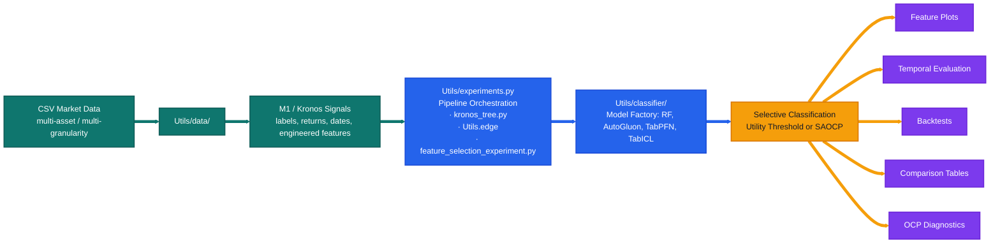
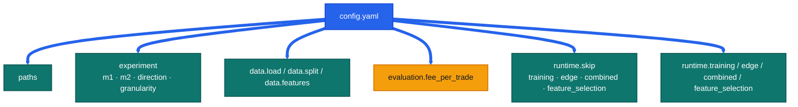
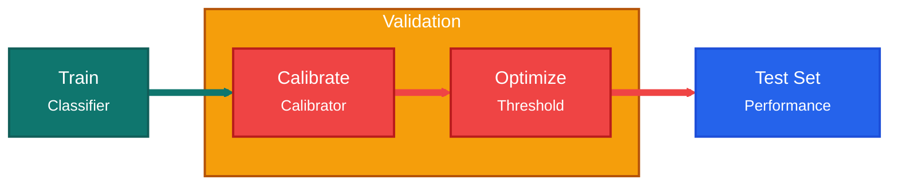
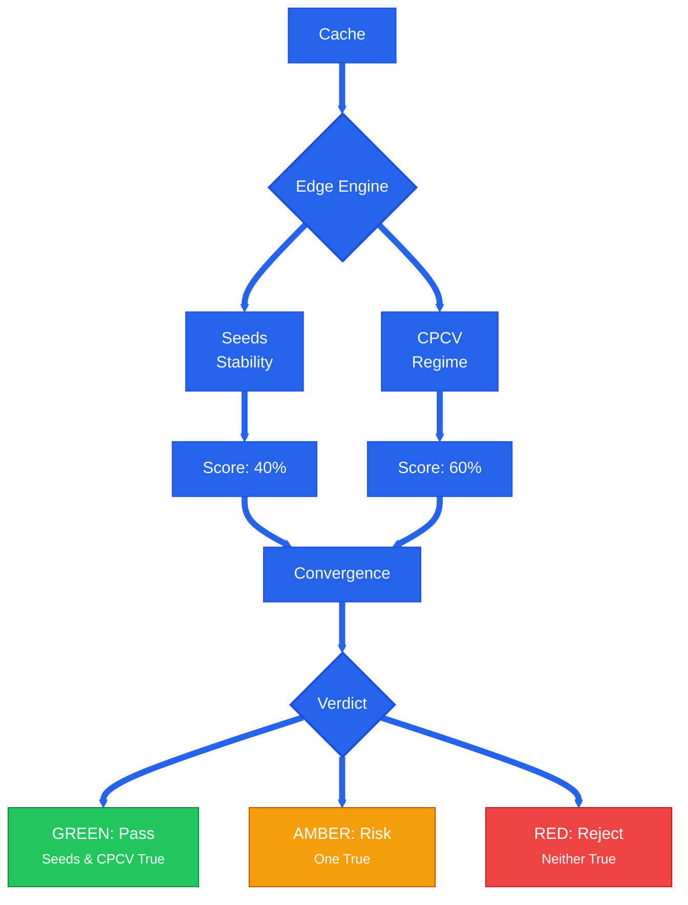

# Secondary-Model

<p align="center">
  
  
  
  
  
</p>

> Current `src/` workspace for the Secondary Model of the Meta-Labeling architecture, which operates on top of financial foundation models: **Kronos**, **Fincast**, **Chronos2**, **Tirex**.
> Driven by a **single unified** [src/config.yaml](src/config.yaml) and orchestrated by [src/Utils/experiments.py](src/Utils/experiments.py).

<table>
  <tr>
    <td bgcolor="#ccfbf1"><strong>Main Entry</strong><br /><code>Utils/experiments.py</code></td>
    <td bgcolor="#dbeafe"><strong>Model Registry</strong><br /><code>Utils/classifier/</code></td>
    <td bgcolor="#dbeafe"><strong>Unified Config</strong><br /><code>config.yaml</code></td>
    <td bgcolor="#fef3c7"><strong>Outputs</strong><br /><code>src/Output/&lt;M1&gt;/</code></td>
    <td bgcolor="#ede9fe"><strong>OCP Diagnostics</strong><br /><code>python -m Utils.ocp.analysis</code></td>
  </tr>
</table>

---

## Visual Overview

<p>
  
  
  
  
  
</p>





---

## Core Architecture: Calibration-First

The pipeline follows a strict **Calibration-First** architecture designed to eliminate data leakage and ensure statistical validity in financial meta-labeling.

### 1. The 4-Way Splitting Protocol
Unlike standard Train/Test splits, our workflow enforces a 4-tuple boundary to isolate model fitting, probability calibration, and threshold optimization.



| Window | Subset | Purpose |
| --- | --- | --- |
| **Train** | Training | Fitting the base classifier (RF, AutoGluon, TabPFN, or TabICL). |
| **Val-Cal** | Calibration | Fitting the probability calibrator (Isotonic Regression or Platt Scaling). |
| **Val-Opt** | Optimization | Searching for the optimal financial utility threshold (Selective Classification). |
| **Test** | Evaluation | Final, isolated out-of-sample backtest and performance monitoring. |

### 2. Leakage Elimination & Embargo
We enforce **Temporal Embargoes** at every boundary. A purge window (based on the forecast horizon) is removed between `Train`, `Val`, and `Test` sets to prevent information leakage from overlapping labels in the financial time series.

---

## Utils/ Package Architecture

The `Utils/` directory is a fully modular Python package tree. Each subdirectory is a standalone package with a curated public API in its `__init__.py`. There are no flat `.py` shim files — all logic lives in the subpackages.

```
src/Utils/
├── __init__.py                        # top-level re-exports + sys.modules aliases for pickle compat
├── utils.py                           # shared small helpers (logging, path utils, etc.)
├── experiments.py                     # experiment orchestrator (training → edge → backtest)
│
├── classifier/                        # MODEL REGISTRY — single source of truth for all classifiers
│   ├── _classifier.py                 # BaseClassifier ABC (fit/predict/predict_proba/get_params/save/load)
│   ├── random_forest_classifier.py    # RFClassifier (sklearn RF with OOB support)
│   ├── tabpfn_classifier.py           # TabPFN zero-shot wrapper (full HPO search space)
│   ├── tabpfn_finetuned_classifier.py # TabPFNFineTuned gradient-based fine-tuning wrapper
│   ├── tabicl_classifier.py           # TabICL in-context learning wrapper
│   ├── autogluon_classifier.py        # AutoGluon multi-stack wrapper
│   ├── factory.py                     # _build_tree_model(), MODEL_CHOICES, MODELS_NO_SCALING
│   └── __init__.py                    # re-exports all classifiers + factory symbols
│
├── ts_cross_validation/               # TIME-SERIES CV PRIMITIVES
│   ├── _ts_cross_validation.py        # base CV logic
│   ├── combinatorial_purged_cv.py     # CombinatorialPurgedCV (datetime-based default, mode="index" compat)
│   ├── purged_embargo_cv.py           # PurgedEmbargoCV
│   ├── embargo_splits.py              # compute_embargo_splits helpers
│   ├── sklearn_ts_cv.py               # sklearn-compatible wrappers
│   └── __init__.py
│
├── feature_selection/                 # FEATURE ANALYSIS
│   ├── feature_selection.py           # MDI/MDA/SFI importance, selection logic
│   ├── plots.py                       # feature ranking plots, confusion matrices, return histograms
│   └── __init__.py
│
├── selective_classification/          # SELECTIVE CLASSIFICATION
│   ├── calibration.py                 # probability calibration (Isotonic, Platt)
│   ├── thresholds.py                  # utility-threshold search and application
│   └── __init__.py
│
├── backtest/                          # BACKTESTING & COMPARISON
│   ├── engine.py                      # equity construction, Sharpe, drawdown, run_combined_backtest
│   ├── plots.py                       # equity curves, performance dashboards
│   ├── comparison.py                  # separate-vs-unified, paradigm-level comparison tables
│   └── __init__.py
│
├── data/                              # DATA LOADING & PREPROCESSING
│   ├── data.py                        # MultiGranDataset, split_by_global_time, load_dataset_from_config
│   └── __init__.py
│
├── edge/                              # EDGE CONVERGENCE (Gate Keeper)
│   ├── edge.py                        # seeds stability + CPCV regime analysis, convergence scoring
│   ├── plots.py                       # edge report visualizations
│   ├── __main__.py                    # entrypoint: python -m Utils.edge
│   └── __init__.py
│
├── hpo/                               # HYPERPARAMETER OPTIMIZATION (Optuna)
│   ├── runner.py                      # trial execution, study management
│   ├── objectives.py                  # per-model objective functions
│   ├── search_spaces.py               # suggest_* functions (rf, tabpfn, tabicl, autogluon)
│   ├── main.py                        # CLI argument parsing
│   ├── __main__.py                    # entrypoint: python -m Utils.hpo
│   └── __init__.py
│
└── ocp/                               # ONLINE CONFORMAL PREDICTION
    ├── saocp.py                       # SAOCP core logic
    ├── plots.py                       # OCP diagnostic plots
    ├── analysis.py                    # CLI dispatcher: python -m Utils.ocp.analysis
    ├── theory.py                      # CLI dispatcher: python -m Utils.ocp.theory
    ├── _analysis_impl.py              # full OCP practical diagnostics CLI
    ├── _theory_impl.py                # full OCP theory/simulation CLI
    └── __init__.py
```

### Import conventions

All packages expose a clean public API through their `__init__.py`. Import from the package, not from internal submodules:

```python
# Correct
from Utils.classifier import TabPFN, _build_tree_model, MODEL_CHOICES
from Utils.backtest import run_combined_backtest, GRAN_ORDER
from Utils.data import load_dataset_from_config, split_by_global_time
from Utils.edge import run_cpcv_analysis, _gran_to_timedelta
from Utils.hpo import run_hpo

# Also correct (for internal helpers not re-exported at package level)
from Utils.classifier.factory import _AG_TIME_LIMIT, _AG_PRESETS
from Utils.ocp.saocp import _run_saocp_online
```

Legacy import paths (`Utils.data_preprocessing`, `Utils.models`, etc.) are aliased in `Utils/__init__.py` via `sys.modules` for pickle-cache compatibility, but should not be used in new code.

---

## Model Registry: `Utils/classifier/`

All classifiers are `BaseClassifier` subclasses (sklearn-compatible: `fit` / `predict` / `predict_proba` / `get_params` / `save_model` / `load_model`). The `factory.py` module builds the correct classifier from a model name string.

### 1. Ensemble Tree Models
- **Random Forest (`rf`)**: Canonical baseline. Supports OOB predictions for streamlined probability calibration without a held-out val set.

### 2. AutoGluon (`autogluon`)
Automated ML suite: multi-layer stacking and ensembling (Trees, KNN, Linear Models) within a time budget. Useful when no single architecture is known to dominate.

### 3. TabPFN (Prior-Data Fitted Networks)
Foundation model for tabular data. Uses In-Context Learning (ICL) — a Transformer pre-trained on synthetic datasets performs zero-shot classification in a single forward pass.
- **Reference**: [PriorLabs/TabPFN](https://github.com/PriorLabs/TabPFN)
- **Zero-Shot (`tabpfn`)**: Pre-trained prior directly. Full HPO search space: `n_estimators`, `softmax_temperature`, `balance_probabilities`, `average_before_softmax`, `fit_mode`, `inference_config`.
- **Fine-Tuned (`tabpfn_ft`)**: Gradient-based fine-tuning to adapt to specific market distributions. Configurable `epochs`, `learning_rate`, `weight_decay`, `grad_clip_value`, `early_stopping`, `use_lr_scheduler`.

### 4. TabICL (Tabular In-Context Learning)
Transformer-based foundation model from INRIA/Soda. Same ICL principle as TabPFN, different architecture and training procedure.
- **Reference**: [soda-inria/tabicl](https://github.com/soda-inria/tabicl)
- **Zero-Shot (`tabicl`)**: Pre-trained checkpoint. Internally normalises features — do not pre-scale inputs.

All models share a 50 000-row soft sub-sampling guard (`_TABPFN_MAX_ROWS`) that warns and randomly sub-samples when exceeded.

---

## Edge Convergence: The Gate Keeper

Model performance on a single test set is often a "lucky" snapshot. `Utils/edge/` provides a statistically robust protocol to determine if a model is truly ready for deployment.

### The Principle of Convergence
A model is considered "Converged" only if it passes two independent stress tests:
1. **Regime Sensitivity (CPCV)**: Does the model hold up when the market regime shifts?
2. **Model Stability (Seeds)**: Is the model's alpha stable across random seeds?



CPCV uses **datetime-based block partitioning** by default (`CombinatorialPurgedCV(mode="datetime")`), where blocks are defined by equal calendar spans and purge windows match `horizon × bar_width`. Index-based partitioning is available as `mode="index"` for backward compatibility.

### Convergence Gate Conditions — the exact rules

The convergence verdict is **not** a handcrafted heuristic — it's the outcome of two independent quantitative gates (see [`Utils/edge/edge.py`](src/Utils/edge/edge.py)).

**Gate 1 — CPCV (Regime Sensitivity).** Evaluated across all CPCV back-test paths:

```
cpcv_pass  ⇔  median_path_sharpe > 0   AND   fraction_profitable > 0.60
cpcv_score = fraction_profitable × clip(median_path_sharpe, 0, 1)
```

`fraction_profitable` is the share of CPCV paths with positive total return; `median_path_sharpe` is the median of per-path Sharpe ratios.

**Gate 2 — Seeds (Model Stability).** Evaluated over N random-seed replicas (default `N = 100`) on a held-out **Val-Eval** split (see below):

```
sharpe_ci_lower = mean_sharpe − 1.96 · std_sharpe / √N
seeds_pass  ⇔  fraction_profitable > 0.70   AND   sharpe_ci_lower > 0
CV_sharpe   = std_sharpe / |mean_sharpe|
seeds_score = fraction_profitable × clip(1 − CV_sharpe, 0, 1)
```

**Final verdict and composite score.**

```
verdict = GREEN  if cpcv_pass ∧ seeds_pass
          AMBER  if cpcv_pass ⊕ seeds_pass
          RED    otherwise
final_score = 0.6 · cpcv_score + 0.4 · seeds_score
```

**Val-Eval split for seeds mode (test-set integrity).** To keep the real test window fully unseen during stability measurement, `seeds` mode carves a 4-way split **entirely inside the Train+Val timeline** — the real test window is never touched. Ratios (of the Train+Val span) are:

```
[ Train 65% | purge | Val-Cal 12% | purge | Val-Opt 10% | purge | Val-Eval 13% ]   ( | Test — untouched )
```

Each boundary is separated by a purge of `horizon × bar_width` to prevent label leakage. `Val-Eval` is the hold-out on which per-seed Sharpe / return / precision are measured. See [`Utils/ts_cross_validation/embargo_splits.py::compute_seeds_embargo_splits`](src/Utils/ts_cross_validation/embargo_splits.py).

---

## Setup

### 1. Conda environment

All scripts must run inside the `CTTS` conda environment. Activate it once per terminal session:

```bash
conda activate CTTS
```

Or prefix any command with `conda run -n CTTS` to run it without activating:

```bash
conda run -n CTTS python Utils/experiments.py --config config.yaml
```

### 2. Working directory

All commands below assume you are in `Secondary-Model/src/`:

```bash
cd /home/pablo/M2_DS/Secondary-Model/src
conda activate CTTS
```

---

## Run Guide

### Unified workflow — edit `config.yaml`, then launch `Utils/experiments.py`

There is **one** entry point and **one** config. To switch M1 backbones, models, directions, granularities, or which phases run, edit [config.yaml](src/config.yaml) — no CLI flags.

```bash
conda run -n CTTS python Utils/experiments.py --config config.yaml
```

`experiments.py` reads the YAML, serializes it to JSON, and fans out subprocesses (`kronos_tree.py`, `python -m Utils.edge`, `feature_selection_experiment.py`). All three read the same config dict, so there is no drift between the orchestrator and its workers.

#### Config knobs that drive the run

| Section | Key | What it does |
| --- | --- | --- |
| `experiment` | `m1` | M1 backbone — one of `kronos`, `fincast`, `chronos2`, `tirex`. **Must also update `paths.csv_dir` and `data.load.m1` to match.** |
| `experiment` | `m2` | List of M2 models to run (`randforest`, `xgboost`, `autogluon`, `tabpfn`, `tabpfn_ft`, `tabicl`). |
| `experiment` | `direction` | List of directions (`up`, `down`, or both). |
| `experiment` | `granularity` | List of granularities (`1d`, `12h`, `8h`, `6`, `4h`, `2h`, `1h`, `30m`). |
| `runtime.skip` | `training` / `edge` / `combined` / `feature_selection` | Flip to `false` to enable each phase. `true` skips it. |
| `runtime.training` | `thres`, `ocp_alpha`, `ocp_costs`, `ocp_window_days`, `all_grans`, `top5`, `run_features` | Training-phase knobs: threshold selection mode, OCP cost vector, unified-vs-per-gran mode, feature sub-analysis toggles. |
| `runtime.edge` | `n_trials`, `n_blocks`, `k_test` | Edge convergence protocol — seeds + CPCV shape. |
| `runtime.combined` | `combined_backtest` | Populated automatically by `experiments.py`; leave as-is. |
| `runtime.feature_selection` | `cv_strategy`, `n_blocks`, `k_test`, `method`, `scoring`, `min_features`, `max_features`, `take_n_best_combinations` | SFS+/RFECV feature-selection knobs. |

#### Phases (driven by `runtime.skip`)

| Phase | What it runs | Enable via |
| --- | --- | --- |
| **1. Training** | `kronos_tree.py` per `(m2 × direction × granularity)` — 4-way split → train → calibrate → threshold → backtest. | `runtime.skip.training: false` |
| **2. Edge** | `python -m Utils.edge` in `seeds` → `cpcv` → `convergence` modes per `(m2 × direction × granularity)`. | `runtime.skip.edge: false` |
| **3. Combined** | `kronos_tree.py` in `combined` phase — merges each model's UP+DOWN backtests. | `runtime.skip.combined: false` |
| **4. Feature selection** | `feature_selection_experiment.py` — SFS+/RFECV driven by `runtime.feature_selection`. | `runtime.skip.feature_selection: false` |

#### Switching M1 backbone

Edit three fields together, then run `experiments.py`:

```yaml
paths:
  csv_dir: "/home/pablo/M2_DS/Secondary-Model/src/Data_MLA/Fincast/Crypto/TP/horizon_7"
experiment:
  m1: "fincast"
data:
  load:
    m1: "fincast"
```

`_load_config` validates that `data.load.m1` is consistent with `paths.csv_dir` and aborts with a clear error if they disagree.

> **AutoGluon note**: `time_limit` (default 300 s) and `presets` (default `best_quality`) are set in `Utils/classifier/factory.py` constants `_AG_TIME_LIMIT` and `_AG_PRESETS`. Edit those to change the defaults globally.

---

### `Utils/hpo/` — Hyperparameter Optimization (standalone)

HPO is **not** wired into `experiments.py`. Run it directly with Optuna when you want to tune a specific `(model, direction, granularity)` combination. It reads the same `config.yaml` for paths, splits, and fees.

```bash
# HPO for RF — up direction, 4h granularity, 50 trials
conda run -n CTTS python -m Utils.hpo \
  --config config.yaml \
  --models rf \
  --directions up \
  --grans 4h \
  --n-trials 50

# HPO for TabPFN + TabICL — both directions, multiple granularities
conda run -n CTTS python -m Utils.hpo \
  --config config.yaml \
  --models tabpfn tabicl \
  --directions up down \
  --grans 4h 1d 8h \
  --n-trials 100
```

Results are saved to `Output/<M1>/HPO/<model>/<direction>/<gran>/best_params.json`.

---

### `Utils/ocp/` — OCP Diagnostics (standalone)

Post-hoc analysis of completed OCP runs. Requires a result folder produced by the training phase with `runtime.training.thres` set to an OCP mode.

```bash
# Practical diagnostics — per-granularity result folder
conda run -n CTTS python -m Utils.ocp.analysis \
  --folder Output/Kronos/randforest/UP/OCP/4h_up_tp

# Theory / simulation studies (requires a cache .pt file)
conda run -n CTTS python -m Utils.ocp.theory \
  --cache Output/Kronos/cache/multi_kronos_7_fee_up_<hash>.pt
```

> Replace `<hash>` with the actual MD5 suffix emitted by `_build_cache_from_config` when the cache is first created.

---

## Current Project Map

| Path | Role |
| --- | --- |
| `config.yaml` | **Single source of truth** — paths, dates, features, M1 backbone, M2 model list, phase toggles, OCP knobs, edge/feature-selection parameters. |
| `Utils/experiments.py` | **User entry point.** Reads `config.yaml`, orchestrates training → edge → combined → feature-selection phases across every `(m2 × direction × granularity)` combination. |
| `kronos_tree.py` | Worker for training and combined phases; invoked as a subprocess by `experiments.py` with the JSON-serialized config. Not meant to be called directly. |
| `feature_selection_experiment.py` | Worker for the feature-selection phase; invoked as a subprocess by `experiments.py`. |
| `Utils/classifier/` | Central model registry: `BaseClassifier` ABC, all classifier wrappers, `_build_tree_model` factory, `MODEL_CHOICES`, `MODELS_NO_SCALING`. |
| `Utils/edge/` | Worker for the edge phase — seeds stability + CPCV regime sensitivity. Invoked as `python -m Utils.edge` by `experiments.py`. |
| `Utils/data/` | Dataset loading, multi-asset assembly, multi-granularity wrapping, chronological splitting, embargo/purge logic. |
| `Utils/feature_selection/` | Feature plots, feature ranking, confusion matrices, return histograms, and probability diagnostics. |
| `Utils/backtest/` | Backtest helpers, equity construction, Sharpe/drawdown, reporting, combined UP+DOWN backtest, comparison tables. |
| `Utils/hpo/` | Optuna-based HPO — **standalone**, not orchestrated by `experiments.py`. CLI: `python -m Utils.hpo`. |
| `Utils/ocp/` | SAOCP core logic + OCP diagnostic CLI. CLI: `python -m Utils.ocp.analysis`, `python -m Utils.ocp.theory`. |
| `Utils/selective_classification/` | Probability calibration (Isotonic, Platt) and utility-threshold selection. |
| `Utils/ts_cross_validation/` | CPCV, PurgedEmbargoCV, embargo-split helpers for financial time-series CV. |
| `Data_MLA/` | Per-M1 dataset assets and technical indicator computation (one subfolder per backbone: `Kronos/`, `Fincast/`, `Chronos2/`, `Tirex/`). |

---

## Configuration Reference

The project has exactly **one** config file: [src/config.yaml](src/config.yaml). Its schema:

```yaml
# ┏━━━━━━━━━━ Paths ━━━━━━━━━━┓
paths:
  csv_dir:     "/home/pablo/M2_DS/Secondary-Model/src/Data_MLA/Kronos/Crypto/TP/horizon_7"
  output_root: "/home/pablo/M2_DS/Secondary-Model/src/Output"

# ┏━━━━━━━━━━ Experiment matrix — the cross product that experiments.py sweeps ━━━━━━━━━━┓
experiment:
  m1:          "kronos"                            # kronos | fincast | chronos2 | tirex
  m2:          ["randforest"]                      # randforest | xgboost | autogluon | tabpfn | tabpfn_ft | tabicl
  direction:   ["up", "down"]
  granularity: ["1d", "12h", "8h", "6", "4h", "2h", "1h", "30m"]

# ┏━━━━━━━━━━ Data ━━━━━━━━━━┓
data:
  load:
    symbol:           null           # null → multi-asset; or ["BTC", "ETH", ...]
    m1:               "kronos"       # MUST match experiment.m1 and paths.csv_dir
    target_col:       "meta_label"
    meta_label_mode:  "tp"           # fp | tp | og
    direction:        "up"
    granularity:      "all"          # "all" = multi-granularity cache
    forecast_horizon: 7
  split:
    start_date: "2024-07-01"
    train_end:  "2025-05-30"
    val_end:    "2025-10-01"
    end_date:   "2026-01-25"
  features:
    input: ["open", "high", "low", "close", "volume"]
    engineered_features:
      selected: [bb_pctb_last, rsi_last, roc_5_last, roc_20_last, atr_norm_last]
    feature_selection:
      enabled: false
      methods: ["mda", "shap", "lime"]
      top_k:   null

# ┏━━━━━━━━━━ Evaluation ━━━━━━━━━━┓
evaluation:
  fee_per_trade: 0.002

# ┏━━━━━━━━━━ Runtime — phase toggles and per-phase knobs ━━━━━━━━━━┓
runtime:
  skip:
    training:          true
    edge:              true
    combined:          true
    feature_selection: false

  training:
    ocp_costs:           [0, 10, 2]
    ocp_alpha:           0.10
    ocp_window_days:     25
    paradigm_comparison: null
    combined_backtest:   null
    comparison:          null
    all_grans:           false
    thres:               "utility"   # utility | OCP | OCP-W | OCP-cost | OCP-cost-mondrian
    top5:                false
    run_features:        false

  edge:
    n_trials: 100
    n_blocks: 6
    k_test:   2

  combined:
    combined_backtest: ["place_holder_up", "place_holder_down"]   # populated by experiments.py
    ocp_costs:         [0, 10, 2]

  feature_selection:
    cv_strategy:              "cpcv"    # cpcv | tscv | pecv
    n_blocks:                 10
    k_test:                   2
    method:                   "sfs+"
    scoring:                  "accuracy"
    min_features:             1
    max_features:             33
    take_n_best_combinations: 10
```

### Parameter meanings

#### `paths`
| Key | Meaning |
| --- | --- |
| `paths.csv_dir` | Root directory of the M1 backbone's processed CSVs. Must match `experiment.m1`. |
| `paths.output_root` | Base output directory. Artifacts land under `Output/<M1>/`. |

#### `experiment`
| Key | Meaning |
| --- | --- |
| `experiment.m1` | M1 backbone. Determines the output bucket (`Output/Kronos/`, `Output/Fincast/`, etc.). |
| `experiment.m2` | List of M2 models to sweep. |
| `experiment.direction` | Directions to sweep (`up`, `down`, or both). |
| `experiment.granularity` | Granularities to sweep. |

#### `data.load`
| Key | Meaning |
| --- | --- |
| `data.load.symbol` | `null` = multi-asset; set a list for asset-specific runs. |
| `data.load.m1` | Must match `experiment.m1` and `paths.csv_dir`. Validated at load time. |
| `data.load.target_col` | Target column the M2 classifier predicts. |
| `data.load.meta_label_mode` | Meta-label variant (`tp` is the active setup). |
| `data.load.direction` | Default direction used for cache rebuilds when no explicit cache is found. |
| `data.load.granularity` | `"all"` enables multi-granularity cache assembly. |
| `data.load.forecast_horizon` | Prediction horizon; drives return alignment, backtests, and OCP delayed feedback. |

#### `data.split`
| Key | Meaning |
| --- | --- |
| `start_date` / `train_end` / `val_end` / `end_date` | Chronological boundaries for Train / Val-Cal / Val-Opt / Test with embargo gaps. |

#### `data.features`
| Key | Meaning |
| --- | --- |
| `features.input` | Raw OHLCV columns fed into indicator computation. |
| `features.engineered_features.selected` | Engineered window-level features exposed to the M2 model. |
| `features.feature_selection.enabled` / `methods` / `top_k` | MDA/SHAP/LIME ranking and optional pruning. |

#### `evaluation`
| Key | Meaning |
| --- | --- |
| `evaluation.fee_per_trade` | Transaction fee used by utility-threshold selection and backtests. |

#### `runtime.skip`
Flip each flag to `false` to enable its phase. `experiments.py` iterates phases 1→4 in order, skipping any that are `true`.

#### `runtime.training`
Threshold mode (`utility`, `OCP`, `OCP-W`, `OCP-cost`, `OCP-cost-mondrian`), OCP cost vector + coverage target + calibration window, plus the `all_grans` / `top5` / `run_features` toggles for unified-vs-per-gran and feature sub-analysis.

#### `runtime.edge`
Seeds trial count (`n_trials`), CPCV block count (`n_blocks`), and CPCV test-block count per split (`k_test`).

#### `runtime.combined`
`combined_backtest` is **auto-populated** by `experiments.py` from the training phase outputs — don't edit the placeholder pair by hand.

#### `runtime.feature_selection`
CV strategy (`cpcv`, `tscv`, `pecv`), SFS+/RFECV shape (`method`, `n_blocks`, `k_test`, `min_features`, `max_features`, `take_n_best_combinations`), and scoring metric (`accuracy`, `precision`, `roc_auc`).

---

## Outputs

```text
src/Output/
├── Analysis/
│   ├── Edge/
│   └── Theory/
└── Kronos/
    ├── autogluon/
    │   ├── DOWN/  {OCP/, Utility_Score/}
    │   └── UP/    {OCP/, Utility_Score/}
    ├── cache/
    └── randforest/
        ├── DOWN/  {OCP/, Utility_Score/}
        └── UP/    {OCP/, Utility_Score/}
```

- `src/Output/<M1>/` is the active result tree for the currently configured M1 backbone.
- `src/Output/<M1>/cache/` stores `MultiGranDataset` pickles, rebuilt on demand from `config.yaml`.
- Additional model folders (`tabpfn/`, `tabicl/`, `xgboost/`) appear when those runs are generated.
- `src/Output/Analysis/` contains edge and theory study outputs (cross-model, cross-M1).

---

## Reporting and Diagnostics

### Comparison Utilities

`Utils/backtest/comparison.py` builds polished summary tables and CSV exports for:
- separate vs unified model structure
- validation and test performance panels
- paradigm-level side-by-side reports

### OCP Diagnostics

`Utils/ocp/analysis.py` (CLI: `python -m Utils.ocp.analysis`) covers:
- fixed-threshold comparison
- random baseline checks
- shuffled-label sanity checks
- rolling conformal coverage
- trade overlap versus utility threshold
- probability calibration inspection

`Utils/ocp/theory.py` (CLI: `python -m Utils.ocp.theory`) covers theoretical/simulation OCP studies.

---

## Practical Notes

- The canonical output location for run results is `src/Output/<M1>/` (M1 taken from `experiment.m1`).
- **Run everything through `Utils/experiments.py`**. `kronos_tree.py`, `Utils.edge`, and `feature_selection_experiment.py` are subprocess workers — they expect `--config` as a **JSON-serialized dict**, not a path, and will not accept a YAML argument.
- `Utils/feature_selection/` and `Utils/backtest/comparison.py` are library modules; they are reached via the training / feature-selection phases in `experiments.py`, not standalone CLI.
- Do **not** pre-scale inputs for TabPFN or TabICL — both models normalize features internally. The scaler bypass is controlled by `MODELS_NO_SCALING` in `Utils/classifier/factory.py`.
- The M2 model list in `experiment.m2` is resolved to concrete classifiers in `Utils/classifier/factory.py` via `_build_tree_model()`.
- `Utils/hpo` and `Utils/ocp.analysis` / `Utils/ocp.theory` are **standalone** — they take `--config config.yaml` as a path and run independently of `experiments.py`.

---

## One-Line Summary

This repository is a modular M2 research workspace for tree-based meta-label filtering, selective-classification tooling, SAOCP diagnostics, backtesting, and comparison reporting, all driven by `config.yaml` and organized as a clean `Utils/` package tree.
