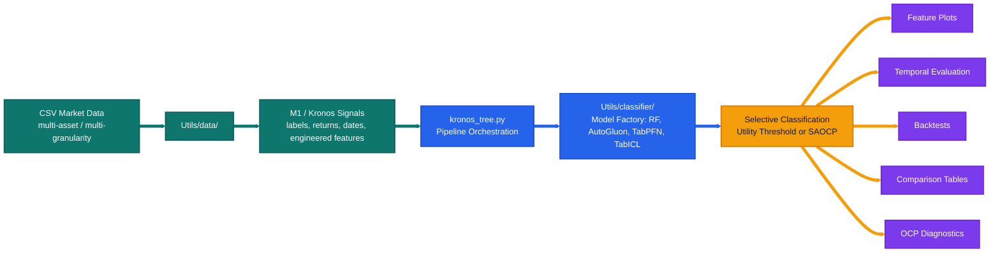
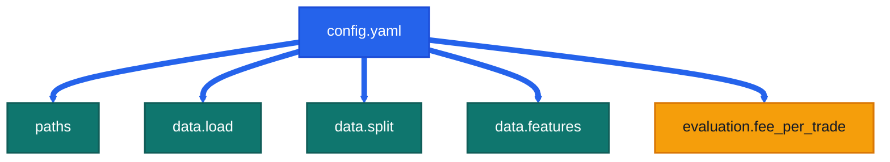
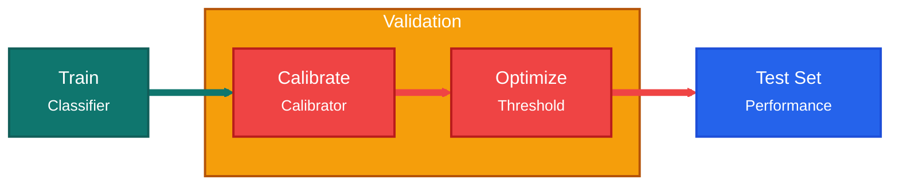
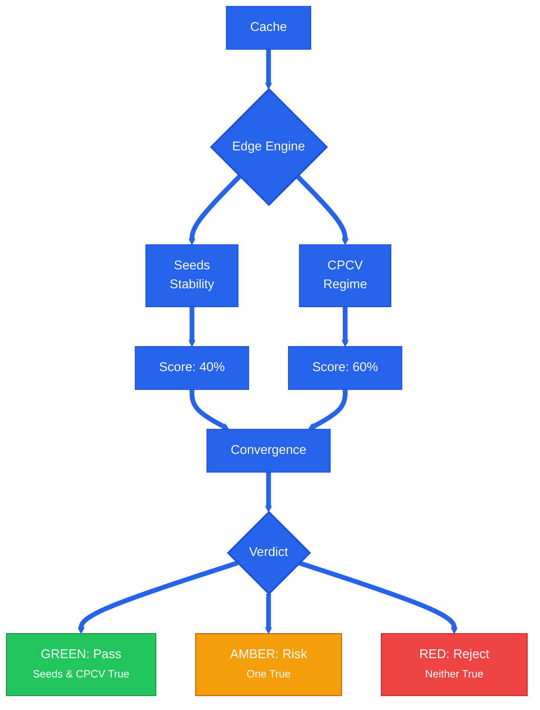

# Secondary-Model

<p align="center">
  
  
  
  
  
</p>

> Current `src/` workspace for the Secondary Model of the Meta-Labeling architecture, which operates on top of financial foundation models: **Kronos** and **Fincast**.
> This README documents the modular tree-based M2 stack around `kronos_tree.py` and its unified configuration suite (`config.yaml`).

<table>
  <tr>
    <td bgcolor="#ccfbf1"><strong>Main Entry</strong><br /><code>kronos_tree.py</code></td>
    <td bgcolor="#dbeafe"><strong>Model Registry</strong><br /><code>Utils/classifier/</code></td>
    <td bgcolor="#dbeafe"><strong>Primary Config</strong><br /><code>config.yaml</code></td>
    <td bgcolor="#fef3c7"><strong>Outputs</strong><br /><code>src/Output/</code></td>
    <td bgcolor="#ede9fe"><strong>OCP Diagnostics</strong><br /><code>python -m Utils.ocp.analysis</code></td>
  </tr>
</table>

---

## Visual Overview

<p>
  
  
  
  
  
</p>





---

## Core Architecture: Calibration-First

The pipeline follows a strict **Calibration-First** architecture designed to eliminate data leakage and ensure statistical validity in financial meta-labeling.

### 1. The 4-Way Splitting Protocol
Unlike standard Train/Test splits, our workflow enforces a 4-tuple boundary to isolate model fitting, probability calibration, and threshold optimization.



| Window | Subset | Purpose |
| --- | --- | --- |
| **Train** | Training | Fitting the base classifier (RF, AutoGluon, TabPFN, or TabICL). |
| **Val-Cal** | Calibration | Fitting the probability calibrator (Isotonic Regression or Platt Scaling). |
| **Val-Opt** | Optimization | Searching for the optimal financial utility threshold (Selective Classification). |
| **Test** | Evaluation | Final, isolated out-of-sample backtest and performance monitoring. |

### 2. Leakage Elimination & Embargo
We enforce **Temporal Embargoes** at every boundary. A purge window (based on the forecast horizon) is removed between `Train`, `Val`, and `Test` sets to prevent information leakage from overlapping labels in the financial time series.

---

## Utils/ Package Architecture

The `Utils/` directory is a fully modular Python package tree. Each subdirectory is a standalone package with a curated public API in its `__init__.py`. There are no flat `.py` shim files — all logic lives in the subpackages.

```
src/Utils/
├── __init__.py                        # top-level re-exports + sys.modules aliases for pickle compat
├── utils.py                           # shared small helpers (logging, path utils, etc.)
├── experiments.py                     # experiment orchestrator (training → edge → backtest)
│
├── classifier/                        # MODEL REGISTRY — single source of truth for all classifiers
│   ├── _classifier.py                 # BaseClassifier ABC (fit/predict/predict_proba/get_params/save/load)
│   ├── random_forest_classifier.py    # RFClassifier (sklearn RF with OOB support)
│   ├── tabpfn_classifier.py           # TabPFN zero-shot wrapper (full HPO search space)
│   ├── tabpfn_finetuned_classifier.py # TabPFNFineTuned gradient-based fine-tuning wrapper
│   ├── tabicl_classifier.py           # TabICL in-context learning wrapper
│   ├── autogluon_classifier.py        # AutoGluon multi-stack wrapper
│   ├── factory.py                     # _build_tree_model(), MODEL_CHOICES, MODELS_NO_SCALING
│   └── __init__.py                    # re-exports all classifiers + factory symbols
│
├── ts_cross_validation/               # TIME-SERIES CV PRIMITIVES
│   ├── _ts_cross_validation.py        # base CV logic
│   ├── combinatorial_purged_cv.py     # CombinatorialPurgedCV (datetime-based default, mode="index" compat)
│   ├── purged_embargo_cv.py           # PurgedEmbargoCV
│   ├── embargo_splits.py              # compute_embargo_splits helpers
│   ├── sklearn_ts_cv.py               # sklearn-compatible wrappers
│   └── __init__.py
│
├── feature_selection/                 # FEATURE ANALYSIS
│   ├── feature_selection.py           # MDI/MDA/SFI importance, selection logic
│   ├── plots.py                       # feature ranking plots, confusion matrices, return histograms
│   └── __init__.py
│
├── selective_classification/          # SELECTIVE CLASSIFICATION
│   ├── calibration.py                 # probability calibration (Isotonic, Platt)
│   ├── thresholds.py                  # utility-threshold search and application
│   └── __init__.py
│
├── backtest/                          # BACKTESTING & COMPARISON
│   ├── engine.py                      # equity construction, Sharpe, drawdown, run_combined_backtest
│   ├── plots.py                       # equity curves, performance dashboards
│   ├── comparison.py                  # separate-vs-unified, paradigm-level comparison tables
│   └── __init__.py
│
├── data/                              # DATA LOADING & PREPROCESSING
│   ├── data.py                        # MultiGranDataset, split_by_global_time, load_dataset_from_config
│   └── __init__.py
│
├── edge/                              # EDGE CONVERGENCE (Gate Keeper)
│   ├── edge.py                        # seeds stability + CPCV regime analysis, convergence scoring
│   ├── plots.py                       # edge report visualizations
│   ├── __main__.py                    # entrypoint: python -m Utils.edge
│   └── __init__.py
│
├── hpo/                               # HYPERPARAMETER OPTIMIZATION (Optuna)
│   ├── runner.py                      # trial execution, study management
│   ├── objectives.py                  # per-model objective functions
│   ├── search_spaces.py               # suggest_* functions (rf, tabpfn, tabicl, autogluon)
│   ├── main.py                        # CLI argument parsing
│   ├── __main__.py                    # entrypoint: python -m Utils.hpo
│   └── __init__.py
│
└── ocp/                               # ONLINE CONFORMAL PREDICTION
    ├── saocp.py                       # SAOCP core logic
    ├── plots.py                       # OCP diagnostic plots
    ├── analysis.py                    # CLI dispatcher: python -m Utils.ocp.analysis
    ├── theory.py                      # CLI dispatcher: python -m Utils.ocp.theory
    ├── _analysis_impl.py              # full OCP practical diagnostics CLI
    ├── _theory_impl.py                # full OCP theory/simulation CLI
    └── __init__.py
```

### Import conventions

All packages expose a clean public API through their `__init__.py`. Import from the package, not from internal submodules:

```python
# Correct
from Utils.classifier import TabPFN, _build_tree_model, MODEL_CHOICES
from Utils.backtest import run_combined_backtest, GRAN_ORDER
from Utils.data import load_dataset_from_config, split_by_global_time
from Utils.edge import run_cpcv_analysis, _gran_to_timedelta
from Utils.hpo import run_hpo

# Also correct (for internal helpers not re-exported at package level)
from Utils.classifier.factory import _AG_TIME_LIMIT, _AG_PRESETS
from Utils.ocp.saocp import _run_saocp_online
```

Legacy import paths (`Utils.data_preprocessing`, `Utils.models`, etc.) are aliased in `Utils/__init__.py` via `sys.modules` for pickle-cache compatibility, but should not be used in new code.

---

## Model Registry: `Utils/classifier/`

All classifiers are `BaseClassifier` subclasses (sklearn-compatible: `fit` / `predict` / `predict_proba` / `get_params` / `save_model` / `load_model`). The `factory.py` module builds the correct classifier from a model name string.

### 1. Ensemble Tree Models
- **Random Forest (`rf`)**: Canonical baseline. Supports OOB predictions for streamlined probability calibration without a held-out val set.

### 2. AutoGluon (`autogluon`)
Automated ML suite: multi-layer stacking and ensembling (Trees, KNN, Linear Models) within a time budget. Useful when no single architecture is known to dominate.

### 3. TabPFN (Prior-Data Fitted Networks)
Foundation model for tabular data. Uses In-Context Learning (ICL) — a Transformer pre-trained on synthetic datasets performs zero-shot classification in a single forward pass.
- **Reference**: [PriorLabs/TabPFN](https://github.com/PriorLabs/TabPFN)
- **Zero-Shot (`tabpfn`)**: Pre-trained prior directly. Full HPO search space: `n_estimators`, `softmax_temperature`, `balance_probabilities`, `average_before_softmax`, `fit_mode`, `inference_config`.
- **Fine-Tuned (`tabpfn_ft`)**: Gradient-based fine-tuning to adapt to specific market distributions. Configurable `epochs`, `learning_rate`, `weight_decay`, `grad_clip_value`, `early_stopping`, `use_lr_scheduler`.

### 4. TabICL (Tabular In-Context Learning)
Transformer-based foundation model from INRIA/Soda. Same ICL principle as TabPFN, different architecture and training procedure.
- **Reference**: [soda-inria/tabicl](https://github.com/soda-inria/tabicl)
- **Zero-Shot (`tabicl`)**: Pre-trained checkpoint. Internally normalises features — do not pre-scale inputs.

All models share a 50 000-row soft sub-sampling guard (`_TABPFN_MAX_ROWS`) that warns and randomly sub-samples when exceeded.

---

## Edge Convergence: The Gate Keeper

Model performance on a single test set is often a "lucky" snapshot. `Utils/edge/` provides a statistically robust protocol to determine if a model is truly ready for deployment.

### The Principle of Convergence
A model is considered "Converged" only if it passes two independent stress tests:
1. **Regime Sensitivity (CPCV)**: Does the model hold up when the market regime shifts?
2. **Model Stability (Seeds)**: Is the model's alpha stable across random seeds?



CPCV uses **datetime-based block partitioning** by default (`CombinatorialPurgedCV(mode="datetime")`), where blocks are defined by equal calendar spans and purge windows match `horizon × bar_width`. Index-based partitioning is available as `mode="index"` for backward compatibility.

---

## Setup

### 1. Conda environment

All scripts must run inside the `CTTS` conda environment. Activate it once per terminal session:

```bash
conda activate CTTS
```

Or prefix any command with `conda run -n CTTS` to run it without activating:

```bash
conda run -n CTTS python kronos_tree.py --config config.yaml --per-gran
```

### 2. Data root

Set `M2_DATA_ROOT` to point to your local data root before running any script. The config files use `${M2_DATA_ROOT}` as a placeholder that gets expanded at load time.

```bash
# macOS (external drive)
export M2_DATA_ROOT=/Volumes/Data/other/2026_NII

# Linux
export M2_DATA_ROOT=/home/pablo/M2_DS/Secondary-Model/src
```

### 3. Working directory

All commands below assume you are in `Secondary-Model/src/`:

```bash
cd /home/pablo/M2_DS/Secondary-Model/src
conda activate CTTS
```

---

## Run Guide

### `kronos_tree.py` — Main Analysis Pipeline

This is the primary entrypoint. It runs the full 4-way split → train → calibrate → threshold → backtest workflow for one or more granularities.

**Available `--model` values:** `rf` (default), `autogluon`, `tabpfn`, `tabpfn_ft`, `tabicl`

**Run modes:**
- `--per-gran` — runs independently for each granularity in the config
- `--all-grans` — runs once across all granularities pooled
- `--combined-backtest UP_DIR DN_DIR` — builds combined UP+DOWN equity curve from two existing result folders

```bash
# Random Forest, all granularities, Kronos M1
conda run -n CTTS python kronos_tree.py --config config.yaml --per-gran

# Random Forest, all granularities, Fincast M1
conda run -n CTTS python kronos_tree.py --config config_fincast.yaml --per-gran

# TabPFN (zero-shot) on Kronos
conda run -n CTTS python kronos_tree.py --config config.yaml --per-gran --model tabpfn

# TabPFN fine-tuned on Kronos
conda run -n CTTS python kronos_tree.py --config config.yaml --per-gran --model tabpfn_ft

# TabICL on Fincast
conda run -n CTTS python kronos_tree.py --config config_fincast.yaml --per-gran --model tabicl

# AutoGluon on Kronos (time_limit=300s per gran, best_quality preset)
conda run -n CTTS python kronos_tree.py --config config.yaml --per-gran --model autogluon

# Combined UP+DOWN backtest from existing result folders
conda run -n CTTS python kronos_tree.py --config config.yaml \
  --combined-backtest \
  Output/Kronos/randforest/UP/Utility_Score \
  Output/Kronos/randforest/DOWN/Utility_Score
```

> **AutoGluon note**: `time_limit` (default 300 s) and `presets` (default `best_quality`) are set in `Utils/classifier/factory.py` constants `_AG_TIME_LIMIT` and `_AG_PRESETS`. Edit those to change the defaults globally.

---

### `Utils/edge/` — Edge Convergence Protocol

Tests whether a trained model's alpha is real (stable across seeds) and robust (stable across market regimes via CPCV). Requires a dataset cache `.pt` file produced by `kronos_tree.py`.

```bash
# Step 1 — Seeds stability (run 100 RF seeds, compare to baseline)
conda run -n CTTS python -m Utils.edge \
  --config config.yaml \
  --cache Output/Kronos/cache/multi_7_fee_up_<hash>.pt \
  --model randforest \
  --mode seeds \
  --trials 100

# Step 2 — CPCV regime sensitivity (6 blocks, combinatorial paths)
conda run -n CTTS python -m Utils.edge \
  --config config.yaml \
  --cache Output/Kronos/cache/multi_7_fee_up_<hash>.pt \
  --model randforest \
  --mode cpcv \
  --n-blocks 6

# Step 3 — Final convergence verdict (GREEN / AMBER / RED)
conda run -n CTTS python -m Utils.edge \
  --config config.yaml \
  --cache Output/Kronos/cache/multi_7_fee_up_<hash>.pt \
  --model randforest \
  --convergence
```

> Replace `<hash>` with the actual MD5 suffix shown when `kronos_tree.py` builds the cache, e.g. `multi_7_fee_up_d2f3ef77ba.pt`.

---

### `Utils/hpo/` — Hyperparameter Optimization

Runs an Optuna study to find the best hyperparameters for a given model/granularity/direction combination. Requires a cache `.pt` file.

**Available `--models` values:** `rf`, `tabpfn`, `tabpfn_ft`, `tabicl`, `autogluon`

```bash
# HPO for RF — up direction, 4h granularity, 50 trials
conda run -n CTTS python -m Utils.hpo \
  --config config.yaml \
  --cache Output/Kronos/cache/multi_7_fee_up_<hash>.pt \
  --models rf \
  --directions up \
  --grans 4h \
  --n-trials 50

# HPO for TabPFN + TabICL — both directions, multiple granularities
conda run -n CTTS python -m Utils.hpo \
  --config config.yaml \
  --cache Output/Kronos/cache/multi_7_fee_up_<hash>.pt \
  --models tabpfn tabicl \
  --directions up down \
  --grans 4h 1d 8h \
  --n-trials 100

# HPO for all models
conda run -n CTTS python -m Utils.hpo \
  --config config.yaml \
  --cache Output/Kronos/cache/multi_7_fee_up_<hash>.pt \
  --models rf tabpfn tabpfn_ft tabicl autogluon \
  --directions up down \
  --grans 4h \
  --n-trials 30
```

Results are saved to `Output/Kronos/hpo/<model>/<direction>/<gran>/best_params.json`.

---

### `Utils/ocp/` — OCP Diagnostics

Post-hoc analysis of completed OCP runs. Requires a result folder produced by `kronos_tree.py` with OCP enabled.

```bash
# Practical diagnostics — per-granularity result folder
conda run -n CTTS python -m Utils.ocp.analysis \
  --folder Output/Kronos/randforest/UP/OCP/4h_up_tp

# Practical diagnostics — unified (all-grans) result folder
conda run -n CTTS python -m Utils.ocp.analysis \
  --folder Output/Kronos/randforest/UP/OCP/unified_up_tp \
  --mode unified

# Theory / simulation studies
conda run -n CTTS python -m Utils.ocp.theory --config config.yaml
```

---

### `Utils/experiments.py` — Full Experiment Suite

Orchestrates training + edge convergence + combined backtests for all models and directions in one command. Useful for overnight batch runs.

```bash
# All models, all directions
conda run -n CTTS python Utils/experiments.py --config config.yaml

# Subset of models
conda run -n CTTS python Utils/experiments.py --config config.yaml --models rf tabicl

# Skip training (re-run edge + backtest on existing results)
conda run -n CTTS python Utils/experiments.py --config config.yaml --skip-training

# Training only (skip edge and combined backtest)
conda run -n CTTS python Utils/experiments.py --config config.yaml \
  --skip-edge --skip-combined

# Explicitly override the M1 model (e.g., target Fincast signals)
conda run -n CTTS python Utils/experiments.py --config config.yaml --m1 fincast
```

---

## Current Project Map

| Path | Role |
| --- | --- |
| `config.yaml` | Unified runtime configuration for all models (paths, dates, features). |
| | Control M1 choice via `export M1_MODEL=...` |
| `kronos_tree.py` | Main M2 analysis entrypoint; orchestrates 4-way splits, training, evaluation, and selective backtesting. |
| `Utils/classifier/` | Central model registry: `BaseClassifier` ABC, all classifier wrappers, `_build_tree_model` factory, `MODEL_CHOICES`, `MODELS_NO_SCALING`. |
| `Utils/edge/` | **The Gate Keeper**: Seeds stability engine + CPCV regime-sensitivity analysis. CLI: `python -m Utils.edge`. |
| `Utils/data/` | Dataset loading, multi-asset assembly, multi-granularity wrapping, chronological splitting, embargo/purge logic. |
| `Utils/feature_selection/` | Feature plots, feature ranking, confusion matrices, return histograms, and probability diagnostics. |
| `Utils/backtest/` | Backtest helpers, equity construction, Sharpe/drawdown, reporting, combined UP+DOWN backtest, comparison tables. |
| `Utils/hpo/` | Optuna-based HPO: objectives, search spaces, runner, CLI entrypoint. CLI: `python -m Utils.hpo`. |
| `Utils/ocp/` | SAOCP core logic + OCP diagnostic CLI. CLI: `python -m Utils.ocp.analysis`, `python -m Utils.ocp.theory`. |
| `Utils/selective_classification/` | Probability calibration (Isotonic, Platt) and utility-threshold selection. |
| `Utils/ts_cross_validation/` | CPCV, PurgedEmbargoCV, embargo-split helpers for financial time-series CV. |
| `Utils/experiments.py` | Experiment orchestrator: training → edge convergence → combined backtests for all models and directions. |
| `Data_MLA/` | Kronos-oriented dataset assets and technical indicator computation. |

---

## Configuration Examples

The project uses a unified configuration file. Below is a snapshot of `config.yaml`.

```yaml
# ┏━━━━━━━━━━ Paths ━━━━━━━━━━┓
paths:
  csv_dir: "/home/pablo/M2_DS/Secondary-Model/src/Data_MLA/Kronos/Crypto/TP/horizon_7"
  output_root: "/home/pablo/M2_DS/Secondary-Model/src/Output"

# ┏━━━━━━━━━━ Data Configuration ━━━━━━━━━━┓
data:
  load:
    symbol:          null          # null → multi-asset; or ["BTC", "ETH", ...]
    target_col:      "meta_label"
    meta_label_mode: "tp"          # "fp" | "tp" | "og"
    direction:       "down"        # "up" | "down"
    granularity:     "all"         # "1d" | "4h" | ... | "all" for multi-granularity
    forecast_horizon: 7
    m1: "fincast"

  split:
    start_date: "2024-07-01"
    train_end:  "2025-05-30"
    val_end:    "2025-10-01"
    end_date:   "2026-01-25"
    context_length: 90

  features:
    input: ["open", "high", "low", "close", "volume"]
    engineered_features:
      selected: [bb_pctb_last, rsi_last, roc_5_last, roc_20_last, atr_norm_last]

# ┏━━━━━━━━━━ Evaluation ━━━━━━━━━━┓
evaluation:
  fee_per_trade: 0.002
```

## `config.yaml` Parameter Meanings

### `paths`

| Key | Meaning |
| --- | --- |
| `paths.csv_dir` | Root directory containing the processed Kronos CSV files. |
| `paths.output_root` | Base output directory. Artifacts are written under `Output/<m1>/`. |

### `data.load`

| Key | Meaning |
| --- | --- |
| `data.load.symbol` | `null` = multi-asset. Set to a symbol or list for asset-specific loading. |
| `data.load.target_col` | Target column the M2 classifier predicts. |
| `data.load.meta_label_mode` | Which meta-label variant to use (`tp` is the current active setup). |
| `data.load.direction` | Trade direction for labeling and evaluation. |
| `data.load.granularity` | `"all"` enables multi-granularity mode. |
| `data.load.forecast_horizon` | Prediction horizon; also governs return alignment, backtesting, and OCP delayed-feedback logic. |
| `data.load.m1` | M1 model that generated upstream signals; determines output bucket (`Output/Kronos/` vs `Output/Fincast/`). |

### `data.split`

| Key | Meaning |
| --- | --- |
| `data.split.start_date` | Earliest date included in the dataset. |
| `data.split.train_end` | End of the training segment. |
| `data.split.val_end` | End of the validation segment. |
| `data.split.end_date` | Final date admitted into the dataset. |
| `data.split.context_length` | Lookback window size per sample. |

### `data.features`

| Key | Meaning |
| --- | --- |
| `data.features.input` | Raw market columns used as base inputs. |
| `data.features.engineered_features.selected` | Engineered window-level features exposed to the tree model. |

### `evaluation`

| Key | Meaning |
| --- | --- |
| `evaluation.fee_per_trade` | Transaction fee assumption for utility and backtest metrics. |

---

## Outputs

```text
src/Output/
├── Analysis/
│   ├── Edge/
│   └── Theory/
└── Kronos/
    ├── autogluon/
    │   ├── DOWN/  {OCP/, Utility_Score/}
    │   └── UP/    {OCP/, Utility_Score/}
    ├── cache/
    └── randforest/
        ├── DOWN/  {OCP/, Utility_Score/}
        └── UP/    {OCP/, Utility_Score/}
```

- `src/Output/Kronos/` is the active result tree for the current M2 workflow.
- `src/Output/Kronos/cache/` stores `MultiGranDataset` pickles used by `kronos_tree.py`.
- Additional model folders (`tabpfn/`, `tabicl/`, `xgboost/`) appear when those runs are generated.
- `src/Output/Analysis/` contains the edge and theory study outputs.

---

## Reporting and Diagnostics

### Comparison Utilities

`Utils/backtest/comparison.py` builds polished summary tables and CSV exports for:
- separate vs unified model structure
- validation and test performance panels
- paradigm-level side-by-side reports

### OCP Diagnostics

`Utils/ocp/analysis.py` (CLI: `python -m Utils.ocp.analysis`) covers:
- fixed-threshold comparison
- random baseline checks
- shuffled-label sanity checks
- rolling conformal coverage
- trade overlap versus utility threshold
- probability calibration inspection

`Utils/ocp/theory.py` (CLI: `python -m Utils.ocp.theory`) covers theoretical/simulation OCP studies.

---

## Practical Notes

- The canonical output location for run results is `src/Output/Kronos/`.
- `kronos_tree.py` is the main CLI. Run it with `--config` and the desired flags.
- `Utils/feature_selection/` is a library module; it is reached through `kronos_tree.py` feature-analysis flags, not standalone CLI.
- `Utils/backtest/comparison.py` is a library module; use it through `kronos_tree.py --comparison` / `--paradigm-comparison`.
- All `python Utils/<module>.py` invocations are replaced by `python -m Utils.<package>`. The old flat files no longer exist.
- Do **not** pre-scale inputs for TabPFN or TabICL — both models normalize features internally.
- The model objects used by `--model` are built in `Utils/classifier/factory.py` via `_build_tree_model()`.

---

## One-Line Summary

This repository is a modular M2 research workspace for tree-based meta-label filtering, selective-classification tooling, SAOCP diagnostics, backtesting, and comparison reporting, all driven by `config.yaml` and organized as a clean `Utils/` package tree.
