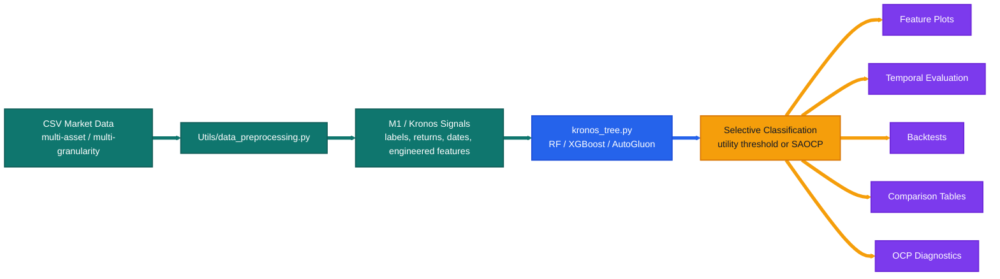
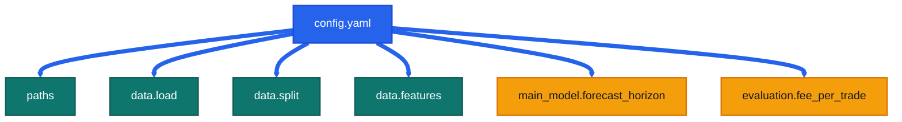

# Secondary-Model

<p align="center">
  
  
  
</p>

> Current `src/` workspace for the Secondary Model of the Meta-Labelng architecture, on top of financial foundation models like Kronos or Fincast.
> This README documents the code that is actually present today: the modular tree-based M2 stack around `kronos_tree.py` and `Utils/`.

<table>
  <tr>
    <td bgcolor="#ccfbf1"><strong>Main Entry</strong><br /><code>kronos_tree.py</code></td>
    <td bgcolor="#dbeafe"><strong>Primary Config</strong><br /><code>config.yaml</code></td>
    <td bgcolor="#ede9fe"><strong>OCP Diagnostics</strong><br /><code>Utils/ocp_analysis.py</code></td>
  </tr>
</table>

---

## Visual Overview

<p>
  
  
  
  
</p>





---

## Codebase Description

<p>
  
</p>

The active `src/` tree is centered on `kronos_tree.py`, which drives the current M2 research workflow for tree-based meta-label filtering on top of Kronos/Fincast signals.

It supports:

- Random Forest, XGBoost, and AutoGluon classifiers
- Feature diagnostics and ranking
- Temporal validation and test evaluation
- Utility-threshold and SAOCP selection
- Backtests and equity curves
- Separate-vs-unified (per-gran vs all-grans) comparison tables
- Practical OCP diagnostics

---

## Current Project Map

<p>
  
  
  
</p>

| Path | Role |
| --- | --- |
| `config.yaml` | Main runtime configuration for paths, dates, selected engineered features, forecast horizon, and fees. |
| `kronos_tree.py` | Main M2 analysis entrypoint and the only primary CLI in this folder. |
| `Utils/data_preprocessing.py` | Dataset loading, multi-asset assembly, multi-granularity wrapping, chronological splitting, and feature plumbing. |
| `Utils/features.py` | Feature plots, feature ranking, confusion matrices, return histograms, and probability diagnostics. |
| `Utils/selective_classification.py` | Risk-coverage utilities, plotting, metrics export, and utility-threshold search. |
| `Utils/saocp.py` | Online Conformal Prediction (OCP) / Strongly Adaptive Online Conformal Prediction (SAOCP) logic, including delayed-feedback online helpers. |
| `Utils/backtest.py` | Backtest helpers, equity construction, Sharpe / drawdown, and reporting. |
| `Utils/comparison.py` | Separate-vs-unified and cross-paradigm comparison builders. |
| `Utils/ocp_analysis.py` | Practical OCP diagnostics for completed result folders. |
| `Utils/ocp_theory.py` | OCP theory-oriented experiments kept separate from the main analysis path. |
| `Data_MLA/` | Kronos-oriented dataset assets, technical indicator computation, and meta-label conversion utilities. |

---

## Run Guide

<p>
  
  
  
</p>

### Working Directory

Run the commands below from:

```bash
cd /home/pablo/M2_DS/Secondary-Model/src
```

### `kronos_tree.py`: Main CLI

`kronos_tree.py` is the real entrypoint. It has four mutually exclusive modes:

| Mode | Command shape | What it does |
| --- | --- | --- |
| single-granularity | `python kronos_tree.py [flags]` | Uses a single-granularity config or cache. |
| per-granularity | `python kronos_tree.py --per-gran [flags]` | Trains one model per granularity from a multi-gran cache. |
| unified | `python kronos_tree.py --all-grans [flags]` | Trains one unified model across all granularities, then reports per granularity. |
| comparison-only | `python kronos_tree.py --comparison ...` or `--paradigm-comparison ...` | Builds comparison artifacts from already completed result folders. |

### `kronos_tree.py`: Command Cookbook

The current `config.yaml` uses `granularity: "all"`, so the normal choices for this repository right now are `--per-gran` and `--all-grans`.

| Use case | Command |
| --- | --- |
| Show the full CLI help | `python kronos_tree.py --help` |
| Single-granularity run with a single-gran config | `python kronos_tree.py --config your_single_gran_config.yaml` |
| Per-granularity run using the current config | `python kronos_tree.py --config config.yaml --per-gran` |
| Unified multi-granularity run using the current config | `python kronos_tree.py --config config.yaml --all-grans` |
| Per-granularity run with an explicit cache | `python kronos_tree.py --config config.yaml --per-gran --cache Output/Kronos/cache/your_multi_cache.pt` |
| Unified run with an explicit cache | `python kronos_tree.py --config config.yaml --all-grans --cache Output/Kronos/cache/your_multi_cache.pt` |
| Per-granularity Random Forest with utility threshold | `python kronos_tree.py --config config.yaml --per-gran --model rf --thres utility` |
| Per-granularity Random Forest with SAOCP | `python kronos_tree.py --config config.yaml --per-gran --model rf --thres OCP --ocp-alpha 0.10` |
| Unified XGBoost run | `python kronos_tree.py --config config.yaml --all-grans --model xgboost --thres utility` |
| Unified AutoGluon run | `python kronos_tree.py --config config.yaml --all-grans --model autogluon --ag-time-limit 900 --ag-presets high_quality` |
| Disable feature analysis completely | `python kronos_tree.py --config config.yaml --per-gran --features false --top5 false` |
| Build separate-vs-unified comparison tables | `python kronos_tree.py --comparison Output/Kronos/randforest Output/Kronos/randforest/unified_down_tp` |
| Build cross-paradigm comparison tables | `python kronos_tree.py --paradigm-comparison Output/Kronos/randforest Output/Kronos/xgboost Output/Kronos/autogluon` |

### `kronos_tree.py`: Flag Reference

| Flag | Values | Meaning |
| --- | --- | --- |
| `--cache` | path to `.pt` | Use an explicit dataset cache instead of resolving it only from `config.yaml`. |
| `--config` | path to YAML | Config file path. Default: `config.yaml`. |
| `--model` | `rf`, `xgboost`, `autogluon` | Selects the classifier family. |
| `--ag-time-limit` | integer seconds | AutoGluon fit time limit per training call. |
| `--ag-presets` | `best_quality`, `high_quality`, `good_quality`, `medium_quality` | AutoGluon preset bundle. |
| `--per-gran` | flag | Train one model per granularity. |
| `--all-grans` | flag | Train one model on all granularities together. |
| `--comparison` | `PER_GRAN_DIR UNIFIED_DIR` | Build comparison outputs from two finished result directories. |
| `--paradigm-comparison` | `DIR DIR ...` | Compare two or more completed paradigms side by side. |
| `--thres` | `utility`, `OCP` | Use validation-set utility thresholding or SAOCP. |
| `--ocp-alpha` | float | Target miscoverage for OCP. `0.10` means a nominal 90% coverage target. |
| `--top5` | `true`, `false` | Whether to run top-5 feature analysis and top-5 backtests. |
| `--features` | `true`, `false` | Whether to run feature analysis at all. |

Important constraint:

- `--top5 true` requires `--features true`

### `features.py`: No Standalone CLI

`Utils/features.py` is a library module, not a script with `argparse`. In normal usage it is triggered indirectly by `kronos_tree.py` when `--features true`.

There is no supported command of the form:

- `python Utils/features.py ...`

If you want to call it directly, use a Python snippet:

```bash
python - <<'PY'
from pathlib import Path
import pandas as pd
from Utils.features import (
    plot_correlation_heatmap,
    plot_mutual_information,
    plot_pointbiserial,
)

df = pd.read_csv("your_feature_frame.csv")
labels = df.pop("label").to_numpy()
save_dir = Path("Output/Kronos/manual_feature_checks")
save_dir.mkdir(parents=True, exist_ok=True)

plot_correlation_heatmap(df, save_dir)
plot_mutual_information(df, labels, save_dir)
plot_pointbiserial(df, labels, ["negative", "positive"], save_dir)
PY
```

Common exported functions include:

- `plot_correlation_heatmap`
- `plot_pointbiserial`
- `plot_class_distributions`
- `plot_mutual_information`
- `plot_tree_importance`
- `plot_confusion_matrix`
- `compute_top_features`

### `comparison.py`: No Standalone CLI

`Utils/comparison.py` is also a library module. The usual way to use it is through:

- `python kronos_tree.py --comparison ...`
- `python kronos_tree.py --paradigm-comparison ...`

There is no supported command of the form:

- `python Utils/comparison.py ...`

If you want to call the module directly, use:

```bash
python - <<'PY'
from pathlib import Path
from Utils.comparison import run_comparison, run_paradigm_comparison

run_comparison(
    Path("Output/Kronos/randforest"),
    Path("Output/Kronos/randforest/unified_down_tp"),
)

run_paradigm_comparison([
    "Output/Kronos/randforest",
    "Output/Kronos/xgboost",
    "Output/Kronos/autogluon",
])
PY
```

---

## Outputs

<p>
  
  
</p>

Current experiment artifacts are written under:

```text
src/Output/Kronos/
```

Typical contents include:

- feature plots and feature-ranking summaries
- confusion matrices and classification metrics
- risk-coverage curves
- OCP / SAOCP diagnostics
- trade logs and backtest CSVs
- equity curves
- `analysis_summary.json`
- `unified_summary.json`
- comparison figures and CSV exports

---

## Exact Current `config.yaml`

<p>
  
  
  
  
</p>

The block below is the current file exactly as it exists today.

```yaml
# ━━━━━━━━━━━━━━━━━━━━━━━━━━━━━━━━━━━━━━━━━━━━━━━━━━━━━━━━━━━━━━━━━━━━━━━
# Kronos Tree Configuration
# ━━━━━━━━━━━━━━━━━━━━━━━━━━━━━━━━━━━━━━━━━━━━━━━━━━━━━━━━━━━━━━━━━━━━━━━

# ┏━━━━━━━━━━ Paths ━━━━━━━━━━┓
paths:
  csv_dir: "/home/pablo/M2_DS/Secondary-Model/src/Data_MLA/Kronos/Crypto/TP/horizon_7"
  output_root: "/home/pablo/M2_DS/Secondary-Model/src/Output"

# ┏━━━━━━━━━━ Data Configuration ━━━━━━━━━━┓
data:
  load:
    symbol:          null          # or null for multi-asset or ["BTC", "ETH", "XRP", ...]
    target_col:      "meta_label"  # "meta_label" or "close" or "ground_truth"
    meta_label_mode: "tp"          # "fp" or "tp" or "og"
    direction:       "down"        # "up" or "down"
    granularity:     "all"         # "1d", "4h", etc. or "all" for multi-granularity

  # ┏━━━━━━━━━━ Data Splits ━━━━━━━━━━┓
  split:
    start_date: "2024-07-01"
    train_end:  "2025-05-30"
    val_end:    "2025-10-01"
    end_date:   "2026-01-25"
    context_length: 90

  # ┏━━━━━━━━━━ Features ━━━━━━━━━━┓
  features:
    input: ["open", "high", "low", "close", "volume"]

    # ┏━━━━━━━━━━ Engineered Window Features ━━━━━━━━━━┓
    engineered_features:
      selected: [bb_pctb_last, rsi_last, roc_5_last, roc_20_last, atr_norm_last]

# ┏━━━━━━━━━━ Main Model ━━━━━━━━━━┓
main_model:
  forecast_horizon: 7

# ┏━━━━━━━━━━ Evaluation ━━━━━━━━━━┓
evaluation:
  fee_per_trade: 0.002
```

---

## `config.yaml` Parameter Meanings

<p>
  
  
  
  
</p>

### `paths`

| Key | Current value | Meaning |
| --- | --- | --- |
| `paths.csv_dir` | `/home/pablo/M2_DS/Secondary-Model/src/Data_MLA/Kronos/Crypto/TP/horizon_7` | Root directory containing the processed Kronos CSV files consumed by the M2 pipeline. |
| `paths.output_root` | `/home/pablo/M2_DS/Secondary-Model/src/Output` | Base output directory. Current Kronos experiment artifacts are then written under `Output/Kronos`. |

### `data.load`

| Key | Current value | Meaning |
| --- | --- | --- |
| `data.load.symbol` | `null` | `null` means multi-asset loading. If set to a symbol or symbol list, loading becomes asset-specific. |
| `data.load.target_col` | `meta_label` | Which target column the M2 classifier learns to predict. |
| `data.load.meta_label_mode` | `tp` | Which meta-label variant to use. `tp` is the current active setup. |
| `data.load.direction` | `down` | Trade direction for the labeling and evaluation path. |
| `data.load.granularity` | `all` | Multi-granularity mode. This is why the main run modes for the current config are `--per-gran` and `--all-grans`. |

### `data.split`

| Key | Current value | Meaning |
| --- | --- | --- |
| `data.split.start_date` | `2024-07-01` | Earliest date included when building the dataset windows. |
| `data.split.train_end` | `2025-05-30` | End of the training segment. Samples after this date move to later splits. |
| `data.split.val_end` | `2025-10-01` | End of the validation segment. Samples after this date move to the test segment. |
| `data.split.end_date` | `2026-01-25` | Final date admitted into the dataset. |
| `data.split.context_length` | `90` | Number of timesteps per lookback window used during dataset construction. |

### `data.features`

| Key | Current value | Meaning |
| --- | --- | --- |
| `data.features.input` | `["open", "high", "low", "close", "volume"]` | Raw market columns used as the base inputs. |
| `data.features.engineered_features.selected` | `[bb_pctb_last, rsi_last, roc_5_last, roc_20_last, atr_norm_last]` | Engineered window-level features exposed to the tree model and the feature-analysis utilities. |

### `main_model`

| Key | Current value | Meaning |
| --- | --- | --- |
| `main_model.forecast_horizon` | `7` | Prediction horizon used by the M2 pipeline. It also matters for return alignment, backtesting, and delayed-feedback OCP logic. |

### `evaluation`

| Key | Current value | Meaning |
| --- | --- | --- |
| `evaluation.fee_per_trade` | `0.002` | Transaction fee assumption used when computing selective-trading utility and backtest metrics. |

---

## Reporting and Diagnostics

<p>
  
  
  
</p>

### Comparison Utilities

`Utils/comparison.py` builds the polished summary tables and CSV exports for:

- separate vs unified model structure
- validation and test performance panels
- backtest comparisons
- paradigm-level side-by-side reports

### OCP Diagnostics

`Utils/ocp_analysis.py` is the practical diagnostic entrypoint for completed OCP runs.

Usage:

```bash
python Utils/ocp_analysis.py --folder Output/Kronos/randforest/8h_down_tp
python Utils/ocp_analysis.py --folder Output/Kronos/randforest/unified_down_tp --mode unified
```

It currently covers:

- fixed-threshold comparison
- random baseline checks
- shuffled-label sanity checks
- rolling conformal coverage
- trade overlap versus utility threshold
- probability calibration inspection

### Theory File Status

`Utils/ocp_theory.py` is still present, but it is not the main path for current practical analysis. For active OCP validation work, use `Utils/ocp_analysis.py`.

---

## Practical Notes

<p>
  
</p>

- The canonical output location for run results is `src/Output/Kronos/`.
- `kronos_tree.py` is the main CLI.
- `Utils/features.py` and `Utils/comparison.py` are callable modules, not standalone command-line programs.
- If you are trying to understand the current M2 stack, focus on `config.yaml`, `kronos_tree.py`, and `Utils/`.

---

## One-Line Summary

This repository is a modular M2 research workspace for tree-based meta-label filtering, selective-classification tooling, SAOCP diagnostics, backtesting, and comparison reporting, all driven by the current `config.yaml`.
