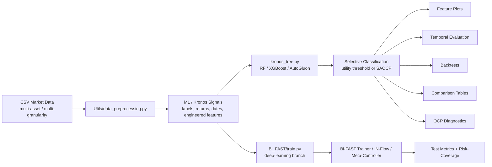
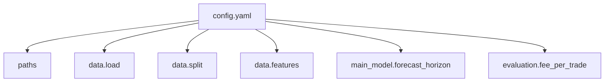

# Secondary-Model

> Current `src/` workspace for the M2 layer of the Kronos pipeline.
> This README documents the code that is actually present today: the tree-based M2 analysis stack, the Bi-FAST deep-learning path, and the modular `Utils/` toolchain.

---

## Visual Overview





---

## What This Codebase Is Now

The active `src/` tree is centered around two complementary M2 workflows:

1. `kronos_tree.py`
   Tree-based meta-labeling analysis for the Kronos M1 output.
   It supports Random Forest, XGBoost, and AutoGluon, and produces feature diagnostics, temporal validation/test metrics, selective-classification operating points, financial backtests, unified-vs-separate comparison tables, and OCP diagnostics.

2. `Bi_FAST/train.py`
   Deep-learning training pipeline for the Bi-FAST branch.
   It combines the main secondary model, IN-Flow normalization/adaptation, a shadow model, and a meta-controller for bi-level sample weighting.

The old README content about a multi-phase HPO exploration stack is no longer the right mental model for this folder.

---

## Current Project Map

| Path | Role |
| --- | --- |
| `config.yaml` | Main runtime configuration for paths, split dates, selected engineered features, forecast horizon, and fees. |
| `kronos_tree.py` | Main M2 analysis entrypoint for tree models and reporting. |
| `Bi_FAST/train.py` | Main deep-learning training/evaluation entrypoint. |
| `Utils/data_preprocessing.py` | Dataset loading, multi-asset assembly, multi-granularity wrapping, temporal splitting, and feature plumbing. |
| `Utils/features.py` | Correlation plots, point-biserial analysis, class distributions, MI, tree importance, and probability diagnostics. |
| `Utils/selective_classification.py` | Risk-coverage utilities, AURC, plotting, metrics export, and utility-threshold search. |
| `Utils/saocp.py` | OCP / SAOCP logic, including delayed-feedback online adaptation helpers. |
| `Utils/backtest.py` | Financial backtest helpers, equity construction, Sharpe / drawdown, and reporting. |
| `Utils/comparison.py` | Per-gran vs unified comparison figures and cross-paradigm comparison tables. |
| `Utils/ocp_analysis.py` | Practical OCP diagnostics on completed experiment folders. |
| `Utils/ocp_theory.py` | Deprecated theory-oriented experiments kept separate from the practical diagnostics path. |
| `Bi_FAST/` | Deep-learning modules: trainer, IN-Flow, shadow model, meta-controller, losses, and DL data helpers. |
| `Data_MLA/` | Meta-label conversion and Kronos-oriented dataset assets. |
| `Data_TSC/` | Raw download and indicator-generation helpers. |

---

## Workflow A: Tree-Based M2 Analysis

### Purpose

`kronos_tree.py` is the main analysis script for the current tree-model pipeline:

- load cached per-granularity or multi-granularity M2 datasets
- train RF / XGBoost / AutoGluon classifiers
- analyze engineered features
- evaluate temporal train/val/test splits
- optimize selective trading thresholds
- optionally run SAOCP-based online conformal selection
- backtest approved trades
- compare separate vs unified paradigms

### Main Modes

| Mode | What it does |
| --- | --- |
| `--per-gran` | Train one model per granularity. |
| `--all-grans` | Train one unified model across all granularities and evaluate each granularity separately. |
| `--comparison PER_GRAN_DIR UNIFIED_DIR` | Build visual comparison tables from completed result folders. |
| `--paradigm-comparison DIR...` | Compare multiple result paradigms side by side. |
| `--thres utility` | Select trades using the validation-set utility threshold. |
| `--thres OCP` | Select trades using SAOCP / online conformal thresholding. |

### Typical Commands

Run from `src/`:

```bash
python kronos_tree.py --per-gran --cache /path/to/multi_cache.pt
python kronos_tree.py --all-grans --cache /path/to/multi_cache.pt
python kronos_tree.py --per-gran --model autogluon --thres OCP --cache /path/to/multi_cache.pt
python kronos_tree.py --comparison Output/Kronos/randforest Output/Kronos/randforest/unified_down_tp
python kronos_tree.py --paradigm-comparison Output/Kronos/randforest Output/Kronos/xgboost Output/Kronos/autogluon
```

### Outputs

Tree-based experiment artifacts are written under:

```text
src/Output/Kronos/
```

Typical contents include:

- feature plots and CSV summaries
- validation and test confusion matrices
- risk-coverage figures
- OCP threshold diagnostics
- backtest equity curves and trade dumps
- `analysis_summary.json`
- `unified_summary.json`
- comparison figures and CSV exports

---

## Workflow B: Bi-FAST Deep-Learning Path

### Purpose

`Bi_FAST/train.py` is the active entrypoint for the deep-learning branch. It implements:

- `SecondaryModel` as the main predictive model
- `INFlowModule` for input adaptation / normalization
- `ShadowModel` for learnability-aware signals
- `MetaController` for dual-gate sample weighting
- bi-level optimization via the Bi-FAST trainer/system stack

### Main Components

| Component | File |
| --- | --- |
| Main model | `Bi_FAST/s2_model.py` |
| IN-Flow module | `Bi_FAST/in_flow.py` |
| Meta-controller | `Bi_FAST/meta_controller.py` |
| Shadow model | `Bi_FAST/shadow_model.py` |
| Trainer / orchestration | `Bi_FAST/bi_level_trainer.py` |
| Train script | `Bi_FAST/train.py` |
| Losses | `Bi_FAST/loss_functions.py` |

### Typical Command

Run from `src/`:

```bash
python Bi_FAST/train.py --config config.yaml
```

This path also uses the shared selective-classification utilities for risk-coverage curves and selective evaluation plots.

---

## Data and Split Logic

The current data plumbing lives in `Utils/data_preprocessing.py`.

### What it handles

- loading datasets from the config-driven CSV layout
- building multi-asset datasets
- building multi-granularity datasets through `MultiGranDataset`
- attaching window-level metadata such as labels, returns, dates, granularity IDs, and engineered features
- performing chronological splitting with `split_by_global_time`

### Important current behaviors

- Multi-granularity mode uses a flat wrapper dataset with per-gran sub-datasets.
- Dates are preserved and used for time-aware splitting and OCP delayed-feedback handling.
- Engineered features are available to the tree-based M2 pipeline.
- The active granularity-to-sequence mapping is defined in `GRAN_SEQ_LEN`.

---

## Configuration Guide

The active config is `src/config.yaml`.

### Key Sections

| Section | Meaning |
| --- | --- |
| `paths.csv_dir` | Root folder of processed Kronos CSV data. |
| `paths.output_root` | Root folder for generated outputs and caches. |
| `data.load.target_col` | Current prediction target, usually `meta_label`. |
| `data.load.meta_label_mode` | Label mode such as `tp`, `fp`, or `og`. |
| `data.load.direction` | Trading direction: `up` or `down`. |
| `data.load.granularity` | A single granularity or `all` for multi-gran runs. |
| `data.split.start_date / train_end / val_end / end_date` | Chronological boundaries for dataset construction and evaluation. |
| `data.split.context_length` | Context window length used during dataset preparation. |
| `data.features.engineered_features.selected` | Hand-selected engineered window features exposed to M2. |
| `main_model.forecast_horizon` | Forecast horizon, reused by backtesting and OCP delay logic. |
| `evaluation.fee_per_trade` | Fee assumption used in financial evaluation. |

### Current Shape

At the time of writing, the active config is oriented around:

- Kronos crypto TP data
- `forecast_horizon: 7`
- selective trading with explicit transaction fees
- multi-granularity operation through `granularity: "all"`

---

## Reporting and Diagnostics

### Comparison Tools

`Utils/comparison.py` produces polished summary tables for:

- separate vs unified models
- cross-paradigm model comparisons
- validation, test, and backtest panels in a single visual artifact

### OCP Diagnostics

`Utils/ocp_analysis.py` is the practical diagnostics entrypoint for finished OCP runs. It includes tests for:

- fixed-threshold comparison
- random baseline checks
- shuffled-label sanity checks
- rolling conformal coverage
- trade overlap versus utility threshold
- reliability / calibration inspection

### Theory File Status

`Utils/ocp_theory.py` is still present, but it is not the main path for current analysis work. The practical diagnostic workflow should go through `Utils/ocp_analysis.py`.

---

## Recommended Reading Order

If you are new to the code, read in this order:

1. `config.yaml`
2. `kronos_tree.py`
3. `Utils/data_preprocessing.py`
4. `Utils/features.py`
5. `Utils/selective_classification.py`
6. `Utils/saocp.py`
7. `Utils/backtest.py`
8. `Utils/comparison.py`
9. `Bi_FAST/train.py`

---

## Practical Notes

- The `src/Analysis/` directory contains legacy generated figures, not the main source code.
- The canonical output root for current experiments is `src/Output/`.
- The tree-analysis stack has already been modularized: feature analysis, backtesting, OCP logic, and comparisons are no longer meant to live inline in `kronos_tree.py`.
- If you are trying to understand current M2 behavior, focus on `kronos_tree.py` and `Utils/`, not the old HPO narrative from the previous README.

---

## One-Line Summary

This `src/` folder is now a modular M2 research workspace: tree-based Kronos meta-labeling analysis, Bi-FAST deep-learning training, selective-classification tooling, OCP diagnostics, and reporting utilities, all driven by the current `config.yaml`.
